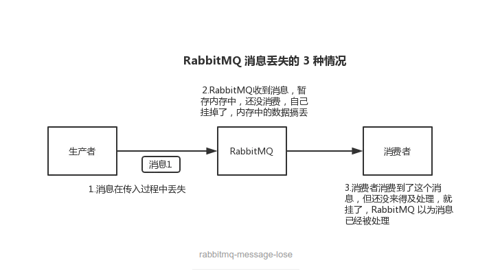

https://www.jianshu.com/p/8a5630e2c317

##### 1.消息丢失怎么办？

- 生产者丢失消息

> 生产者将数据发送到RabbitMQ的时候，可能由于网络问题，半路丢失了。

解决方案：

1. RabbitMQ的事务功能

> 特点：类似mysql事务，同步，吞吐量低，耗性能

2. RabbitMQ的confirm机制

> 开启`confirm`模式，生产者设置开启`confirm`模式后，每次写的消息都会分配一个唯一的id，消息写入到RabbitMQ后，会回传一个`ack`消息，确认消息接收成功；如果RabbitMQ没能处理这个消息，会回调一个`nack`消息，表示接收失败，可以选择重试。

事务机制与`confirm`机制最大的不同在于，事务机制是同步的，提交事务后会阻塞；而`confirm`机制是异步的，发送消息后可以发送下一个消息，RabbitMQ接收之后会异步回调你的一个接口通知这个消息接收到了。

- MQ丢失消息

> 由于MQ服务进程退出等原因造成消息丢失

解决方案：

1. 开启RabbitMQ持久化

> 持久化与`confirm`机制配合，只有消息持久化到磁盘之后，才会通知生产者`ack`.

- 消费者丢失消息

> 消费者端在进行消费消息时，进程退出或重启，RabbitMQ认为该消息已经被消费了，造成了消息丢失。

解决方案：

1. 使用RabbitMQ提供的`ack`机制，消费者端在完整处理完消息时，回复一个`ack`给RabbitMQ，这样RabbitMQ就会把消息给删除，否则RabbitMQ会认为消费者没有处理完该消息，而继续分配给其他消费者处理。

##### 2.消息队列的优缺点，区别

解耦，异步，削峰。

##### 3.消息中间件的高可用

##### 4.如何保证消息的顺序性

##### 5.如何保证消息不被重复消费

> 所有的MQ都有可能出现重复消费的问题。重复消费问题应该是由消费者端保证，也就是消费端的代码上保证。重复消费不可怕，可怕的是没有考虑到重复消费之后，如何保证幂等性问题。

解决方案：

1. 每条消息设置一个唯一的标识符，存放到redis里，在一段时间内有效，每次都要判断标识符是否在redis内，有则直接丢弃消息即可。

##### 6.如何解决消息队列的延时以及过期失效问题？消息队列满了以后该怎么处理？有几百万消息持续积压几小时呢？

##### 7.如果让你写一个消息队列，该如何进行架构设计？
