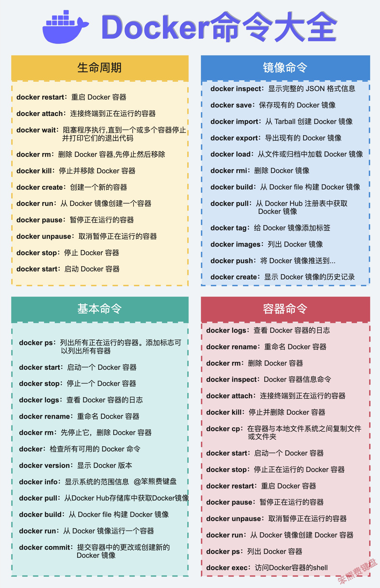
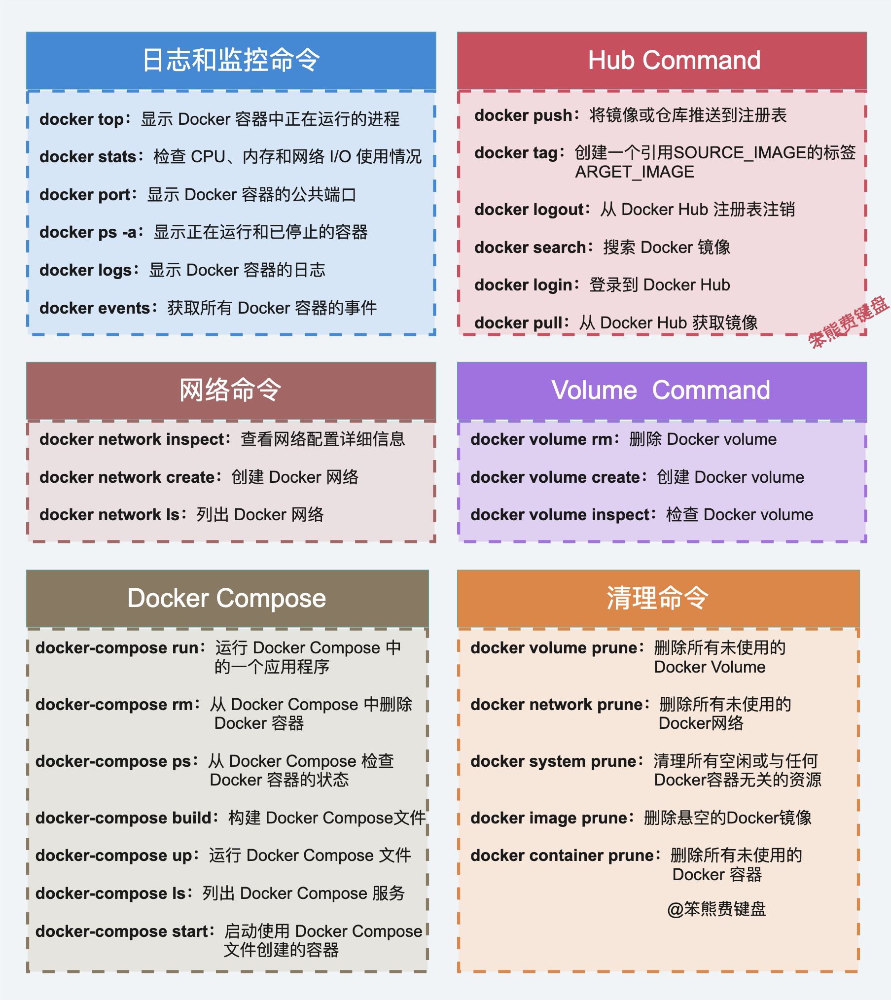

#### 升级docker-compose

```Bash

$ curl -L "https://github.com/docker/compose/releases/download/1.23.2/docker-compose-$(uname -s)-$(uname -m)" -o /usr/local/bin/docker-compose


$ chmod +x /usr/local/bin/docker-compose

$ ln -s /usr/local/bin/docker-compose /usr/bin/docker-compose

$ docker-compose --version

```




