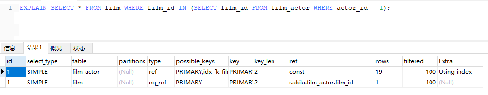
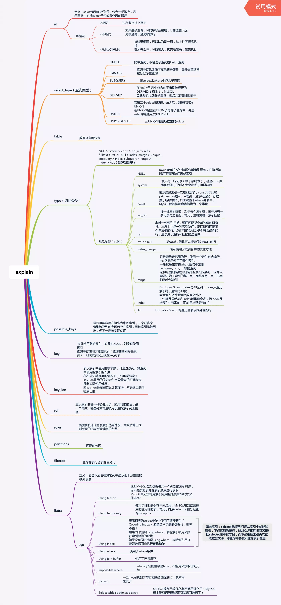

### EXPLAIN关键字
> explain关键字可以模拟MySQL优化器执行SQL语句，可以很好的分析SQL语句或表结构的性能瓶颈。

关键字  | 说明   
--|---|
id  | 选择标识符  
select_type  | 查询的类型  
table  | 输出结果集的表  
partitions  | 匹配的分区  
type  | 表的连接类型   
possible_keys  | 查询时，可能使用的索引  
key  | 实际使用的索引  
key_len  | 索引字段的长度  
ref  | 列与索引的比较  
rows  | 扫描出的行数(估算的行数)  
filtered  | 查询的表行占表的百分比
Extra  | 执行情况的描述和说明

