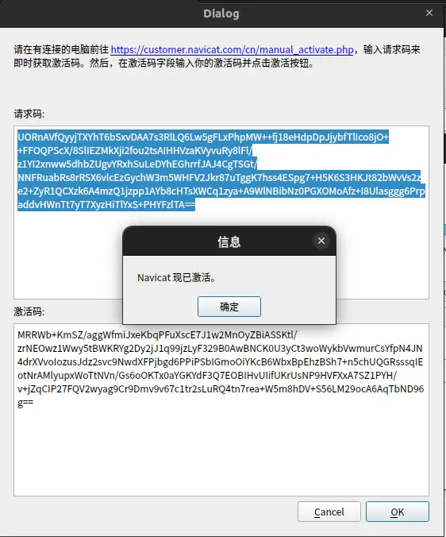

1.安装capstone

> sudo apt-get install libcapstone-dev

2.安装编译工具

> sudo apt-get install cmake libfuse2


下载 百度云盘文件 链接: https://pan.baidu.com/s/18UYMOLYyl8OwafgKMPYzaw 提取码: gxax

```bash
sudo apt-get install libcapstone-dev
sudo apt-get install cmake

git clone https://gitee.com/hub-mirrors/keystone.git
git clone https://gitee.com/hub-mirrors/navicat-keygen-tools.git

sudo apt install libcapstone-dev cmake build-essential rapidjson-dev libssl-dev

```
##生成破解工具和激活工具

#### 安装keystone

```bash

cd keystone
mkdir build
cd build
../make-share.sh
sudo make install
sudo ldconfig


```
#### 安装 navicat-keygen-tools
编译破解工具,进入到文件夹navicat-keygen-tools 修改common目录下的RSACipher.hpp文件

gedit common/RSACipher.hpp

复制109行和110行 将 == 后边的 0x10100000  改为 0x30000000（ubuntu22.04将openssl升级到了3.0.x），如果不改会报 Unexpected openssl version! 错误，这里用的gedit也可以用其他编辑工具修改


修改完成之后执行编译

```bash

make all

```

成功之后会在 navicat-keygen-tools/bin目录下看到 navicat-keygen 和 navicat-patcher


##破解过程
```bash

mkdir navicat15

sudo mount -o loop navicat15-premium-cs.AppImage ./navicat15

cp -r navicat15 navicat15-premium
sudo umount navicat15
rm -r navicat15
cp ./libgio-2.0.so.0.5000.3 ./navicat15-premium/usr/lib/
cd ./navicat15-premium/usr/lib/
ln -s libgio-2.0.so.0.5000.3 libgio-2.0.so.0

```


在存放百度云盘文件根目录执行

```bash

./navicat-keygen-tools/bin/navicat-keygen --text RegPrivateKey.pem

```


复制Serial Number 序列号。

#### 使用打包工具将打好补丁的软件打包成AppImage

##### 先给打包工具附执行权限

sudo chmod +x appimagetool-x86_64.AppImage
##### 打包
```bash
 ./appimagetool-x86_64.AppImage ./navicat15-patched navicat15.AppImage
成功之后给打包好的navicat15.AppImage附执行权限，之后可以直接双击执行

sudo chmod +x navicat15.AppImage

```


复制请求码，粘贴到终端。回车 生成激活码



