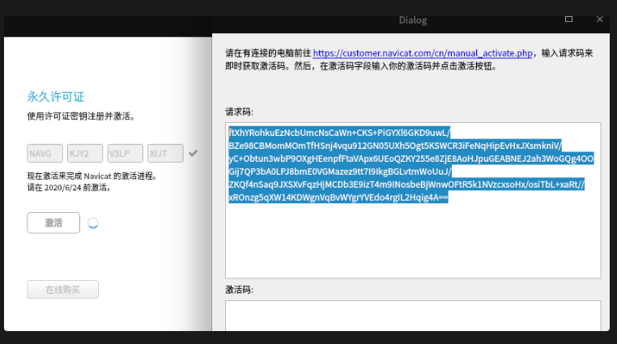
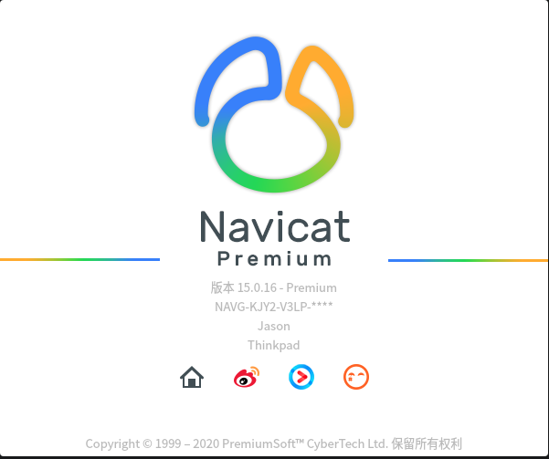
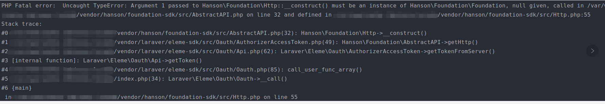

### 系统环境配置

1.安装capstone

> sudo apt-get install libcapstone-dev

2.安装编译工具

> sudo apt-get install cmake

3.安装keystone，下载源码并编译安装keystone

```shell
 git clone https://github.com/keystone-engine/keystone.git

 cd keystone

 mkdir build
 cd build

 ../make-share.sh

 sudo make install
 sudo ldconfig
```

执行 ../make-share.sh 命令错误

```code
-- The C compiler identification is GNU 8.3.0
-- The CXX compiler identification is unknown
-- Check for working C compiler: /usr/bin/cc
-- Check for working C compiler: /usr/bin/cc -- works
-- Detecting C compiler ABI info
-- Detecting C compiler ABI info - done
-- Detecting C compile features
-- Detecting C compile features - done
CMake Error at CMakeLists.txt:5 (project):
  No CMAKE_CXX_COMPILER could be found.

  Tell CMake where to find the compiler by setting either the environment
  variable "CXX" or the CMake cache entry CMAKE_CXX_COMPILER to the full path
  to the compiler, or to the compiler name if it is in the PATH.


-- Configuring incomplete, errors occurred!
See also "/opt/local/navicat/keystone/build/CMakeFiles/CMakeOutput.log".
See also "/opt/local/navicat/keystone/build/CMakeFiles/CMakeError.log".

```

 解决方案：

```code

 sudo apt update
 sudo apt install -y build-essential

```

 4.安装rapidjson

```code
  sudo apt-get install rapidjson-dev
```


#### 破解过程

修改文件权限

```shell

$ chmod +x appimagetool-x86_64.AppImage navicat-patcher navicat-keygen

```

挂载并解包官方AppImage文件

```shell

mkdir navicat15

# 挂载官方包
sudo mount -o loop navicat15-premium-cs.AppImage navicat15

cp -r navicat15 navicat15-patched

# 取消挂载,${path}为当前工作目录的绝对路径,此步骤可省略,如果不取消挂载,你的电脑中将多出一个磁盘.
sudo umount ./navicat15

```
运行破解补丁文件，生成RSA证书.pem文件

```shell

./navicat-patcher navicat15-patched

```

重新打包生成可执行的AppImage文件

```shell

./appimagetool-x86_64.AppImage navicat15-patched navicat15-premium-cs-pathed.AppImage

# 修改文件权限
chmod +x navicat15-premium-cs-pathed.AppImage

```

运行新打包的文件，运行navicat软件

```shell

./navicat15-premium-cs-pathed.AppImage

```

新开一个终端窗口，运行注册机，生成序列号和激活码

```shell

./navicat-keygen --text RegPrivateKey.pem

```

根据提示分别选择产品类型、语言类型、产品版本生成序列号

```shell

**********************************************************
*       Navicat Keygen (Linux) by @DoubleLabyrinth       *
*                   Version: 1.0                         *
**********************************************************
[*] Select Navicat product:
 0. DataModeler
 1. Premium
 2. MySQL
 3. PostgreSQL
 4. Oracle
 5. SQLServer
 6. SQLite
 7. MariaDB
 8. MongoDB
 9. ReportViewer

(Input index)> 1

```

```shell
[*] Select product language:
 0. English
 1. Simplified Chinese
 2. Traditional Chinese
 3. Japanese
 4. Polish
 5. Spanish
 6. French
 7. German
 8. Korean
 9. Russian
 10. Portuguese

(Input index)> 0

```

```shell

[*] Select product language:
 0. English
 1. Simplified Chinese
 2. Traditional Chinese
 3. Japanese
 4. Polish
 5. Spanish
 6. French
 7. German
 8. Korean
 9. Russian
 10. Portuguese

(Input index)> 1

```

```shell

[*] Input major version number:
(range: 0 ~ 15, default: 12)> 15

```

[*] Serial number:
NAVC-PJWW-BKN4-C4YW


● 复制生成的序列号粘贴到运行中的navicat中，点击激活选择手动激活(需断开网络)，然后复制上面的BASE64代码备用

● 填写个人信息、所在组织信息

```shell

[*] Your name: Jason
[*] Your organization: Google

```

粘贴上面复制的BASE64代码后双击回车键生成激活码

```shell

[*] Input request code in Base64: (Double press ENTER to end)
# 此处粘贴navicat软件复制的代码

```

如果没出现错误，则会生成激活码

```shell

[*] Request Info:
{"K":"NAVCPJWWBKN4C4YW", "DI":"B0A1C7E8FA226577356B", "P":"linux"}

[*] Response Info:
{"K":"NAVCPJWWBKN4C4YW","DI":"B0A1C7E8FA226577356B","N":"Jason","O":"Google","T":1582448573}

[*] Activation Code:
# 此处就是生成的激活码

```


将生成的激活码粘贴到navicat中激活即可



