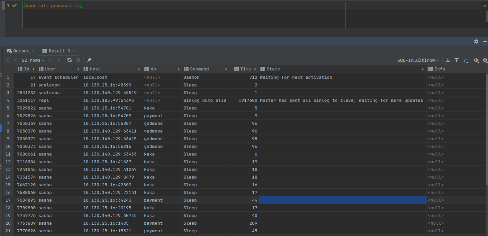
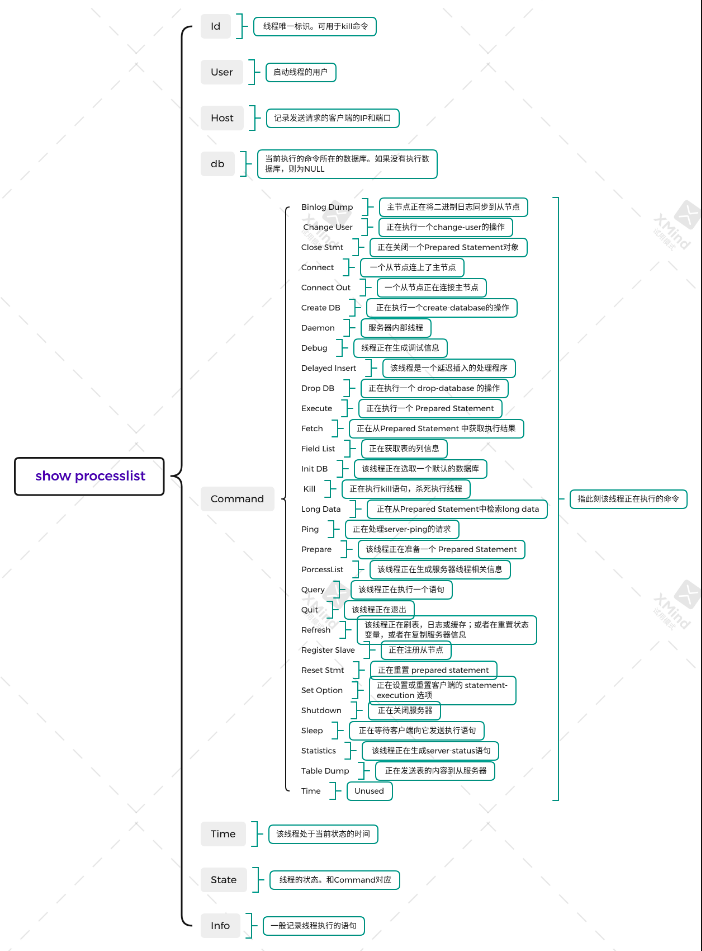

### show full processlist

https://dev.mysql.com/doc/refman/5.6/en/thread-commands.html

https://dev.mysql.com/doc/refman/5.6/en/general-thread-states.html







```code
按客户端 IP 分组，看哪个客户端的链接数最多

select client_ip,count(client_ip) as client_num from (select substring_index(host,':' ,1) as client_ip from  information_schema.processlist ) as connect_info group by client_ip order by client_num desc;

```

```code
查看正在执行的线程，并按 Time 倒排序，看看有没有执行时间特别长的线程

select * from information_schema.processlist where Command != 'Sleep' order by Time desc;

```

```code
杀掉指定id的mysql线程
kill id
```
