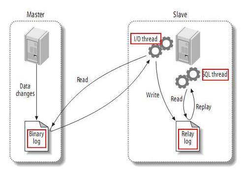

#### 主从复制基本原理

`MySQL`的主从架构依赖于MySQL `Binlog`功能，`Master`节点上产生`Binlog`并且写入到文件中。

`Master`节点上启动一个DUMP线程：当`Slave`节点I/O线程连接`Master`时，`Master`创建这个线程，DUMP线程负责从`Master`的`binlog`文件读取记录，然后发送给`Slave`。每个连接到`Master`的`Slave`都有一个DUMP线程。

`Slave`节点上启动两个线程：`IO线程`和`SQL线程`，`IO线程`从MySQL上拉取`Binlog`日志并写入到本地的`RelayLog`日志；SQL线程不断从`RelayLog`日志中读取日志并解析执行，这样就可以保证所有在主服务器上执行过的SQL语句都在从服务器上一模一样的执行过一遍。

#### 复制延时

> 复制延迟，指的就是一个事务在Master执行完成以后，要多久以后才能在Slave上执行完成。

由于对`Binlog`文件以及`RelayLog`文件的读写均为顺序操作，在生产环境中，`Slave`上的IO线程对`Binlog`文件的Dump操作是很少产生延迟的。实际上，从MySQL5.5开始，MySQL官方提供了半同步复制插件，每个事务的`Binlog`需要保证传输到`Slave`写入`RelayLog`后才能提交，这种架构在主从之间提供了数据完整性，保证了主服务器在发生故障后从服务器可以拥有完整的数据副本。因此，复制延迟通常发生在SQL线程执行的过程中。

在上面的架构图上可以看到，最早的主从复制模型中，只有一个线程负责执行`Relaylog`，也就是说所有在主服务器上的操作，在从服务器上是串行回放的。这就带来一个问题，如果主服务器上写入压力比较大，那么从服务器上的回放速度很有可能会一直跟不上主。既然主从延迟的问题是单线程回放`RelayLog`太慢，那么减少主从延迟的方案自然就是提高从服务器上回放`RelayLog`的并行度。

#### 8.0
在MySQL8.0中，开启了基于WriteSet的事务依赖后，Slave上的 RelayLog回放速度将不再依赖于Master上提交时的并行程度，使得Slave上可以发挥其最大的吞吐能力，这个特性在Slave上复制停止一段时间后恢复复制时尤其有效。

这个特性使得Slave上可能拥有比Master上更大的吞吐量，同时可能在保证事务依赖关系的情况下，在Slave上产生Master上没有产生过的提交场景，事务的提交顺序可能会在Slave上发生改变。虽然在5.7的并行复制中就可能发生这种情况，不过在8.0中由于Slave上更高的并发能力，会使该场景更加常见。通常情况下这不是什么大问题，不过如果在Slave上做基于Binlog的增量备份，可能就需要保证在Slave上与Master上一致的提交顺序，这种情况下可以开启slave_preserve_commit_order，这是一个5.7就引入的参数，可以保证Slave上并行回放的线程按RelayLog中写入的顺序Commit。

主从延迟原理

谈到 MySQL 数据库主从同步延迟原理，得从 MySQL 的主从复制原理说起：

- MySQL 的主从复制都是单线程的操作，主库对所有 DDL 和 DML 产生 binlog，binlog 是顺序写，所以效率很高；
Slave 的 Slave_IO_Running 线程会到主库取日志，放入 relay log，效率会比较高；
- Slave 的 Slave_SQL_Running 线程将主库的 DDL 和 DML 操作都在 Slave 实施，DML 和 DDL 的 IO 操作是随机的，不是顺序的，因此成本会很高，还可能是 Slave 上的其他查询产生 lock 争用，由于 - Slave_SQL_Running 也是单线程的，所以一个 DDL 卡住了，需要执行 10 分钟，那么所有之后的 DDL 会等待这个 DDL 执行完才会继续执行，这就导致了延时。

总结一下主从延迟的主要原因：主从延迟主要是出现在 “relay log 回放” 这一步，当主库的 TPS 并发较高，产生的 DDL 数量超过从库一个 SQL 线程所能承受的范围，那么延时就产生了，当然还有就是可能与从库的大型 query 语句产生了锁等待。

3.2 主从延迟情况

- 从库机器性能：从库机器比主库的机器性能差，只需选择主从库一样规格的机器就好。

- 从库压力大：可以搞了一主多从的架构，还可以把 binlog 接入到 Hadoop 这类系统，让它们提供查询的能力。

- 从库过多：要避免复制的从节点数量过多，从库数据一般以3-5个为宜。

- 大事务：如果一个事务执行就要 10 分钟，那么主库执行完后，给到从库执行，最后这个事务可能就会导致从库延迟 10 分钟啦。日常开发中，不要一次性 delete 太多 SQL，需要分批进行，另外大表的 DDL 语句，也会导致大事务。

- 网络延迟：优化网络，比如带宽 20M 升级到 100M。

- MySQL 版本低：低版本的 MySQL 只支持单线程复制，如果主库并发高，来不及传送到从库，就会导致延迟，可以换用更高版本的 MySQL，支持多线程复制。
