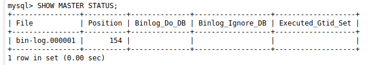
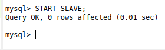
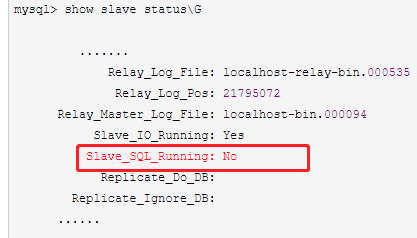

## 基于bin log的主从同步配置

1. master节点设置

```code
my.cnf文件

[mysqld]
# 配置文件修改后，要重新 build
server-id=1 #MySQL实例中全局唯一，并且大于0。
log-bin=/var/lib/mysql/bin-log #设置bin log文件名
read-only=0

```
配置好后，重启master节点。

```mysql
CREATE USER 'replication_user'@'%' IDENTIFIED BY '123456';  #创建
GRANT REPLICATION SLAVE ON *.* TO 'replication_user'@'%' WITH GRANT OPTION;
FLUSH PRIVILEGES;

ALTER USER 'replication_user'@'%' IDENTIFIED WITH mysql_native_password by '123123';

```

2. slave节点配置

```code

docker run -d -p 3307:3306 -e MYSQL_ROOT_PASSWORD=root --name=mysql-3307 -v ~/data/mysql/3307:/var/lib/mysql -v ~/data/mysql/3307-conf/my.cnf:/etc/mysql/conf.d/mysql.cnf  mysql:5.7

my.cnf文件

[mysqld]
server-id=2  #与master节点作区分

```
配置好后，重启slave-1 mysql-3307 节点。


3. master节点上查看bin-log文件名和位置

```mysql

SHOW MASTER STATUS;

```


4. slave节点配置主从连接信息

```mysql

change master to master_host='172.18.0.2',master_user='replication_user',master_port=3306,master_password='123123',master_log_file='bin-log.000001',master_log_pos=154;


master host：MySQL主的地址
master_user：备份的用户名
master_password：备份的用户密码
master_log_file：bin-log的文件名
master_log_pos：bin-log的位置
```
5. slave节点开启同步

```mysql

START SLAVE;

```


查看状态
```mysql

SHOW SLAVE STATUS;

```

## 遇到的问题

> Slave_SQL_Running:No



```
1. slave停止服务：

  SLAVE STOP;

2. master查看bin log和position对应值

  SHOW MASTER STATUS;

3. slave上执行手动同步

  master_host='172.18.0.2',master_user='replication_user',master_port=3306,master_password='123123',master_log_file='xxxxx',master_log_pos=xxxx;

4. 再检查slave状态

  SHOW SLAVE STATUS;
```

********************************************************************

## 基于GTID的主从同步配置

1. master节点设置

```code
my.cnf文件

[mysqld]
# 配置文件修改后，要重新 build
server-id=1 #MySQL实例中全局唯一，并且大于0。
log-bin=/var/lib/mysql/bin-log #设置bin log文件名
read-only=0
gtid-mode=ON  #开启gtid
enforce-gtid-consistency=ON
log_slave_updates=ON


```
配置好后，重启master节点。

```mysql
CREATE USER 'replication_user'@'%' IDENTIFIED BY '123456';  #创建
GRANT REPLICATION SLAVE ON *.* TO 'replication_user'@'%' WITH GRANT OPTION;
FLUSH PRIVILEGES;

ALTER USER 'replication_user'@'%' IDENTIFIED WITH mysql_native_password by '123123';


show variables like '%gtid%';  //查看相关配置

```

2. slave节点配置

```code

docker run -d -p 3307:3306 -e MYSQL_ROOT_PASSWORD=root --name=mysql-3307 -v ~/data/mysql/3307:/var/lib/mysql -v ~/data/mysql/3307-conf/my.cnf:/etc/mysql/conf.d/mysql.cnf  mysql:5.7

my.cnf文件

[mysqld]
server-id=2  #与master节点作区分
log-bin=/var/lib/mysql/bin-log
gtid-mode=ON
enforce-gtid-consistency=ON
binlog_format=ROW
log_slave_updates=ON
```
配置好后，重启slave-1 mysql-3307 节点。


3. slave节点配置主从连接信息

```mysql

change master to master_host='172.18.0.2',master_user='replication_user',master_port=3306,master_password='123123',,master_auto_position=1;

```
4. slave节点开启同步，检查slave状态

```mysql

START SLAVE;

SHOW SLAVE STATUS;
```

### 遇到的问题

1. slave不同步，导致SLAVE_SQL_RUNNING:no

```mysql

stop slave ; # 先停止主从同步
show slave status; #找到执行错的的GTID 编号
SET @@SESSION.GTID_NEXT= '488b7889-d0a5-11ea-b8bb-0242ac110007:139353-146332'; # 如果就是当前ID ，可以不用设置，直接开启空事务跳过
# begin  commit 制造一个空事务
begin;
commit;
SET GTID_NEXT="AUTOMATIC"; #把gtid_next设置回来
start slave; # 启动主从同步

或者重新再来一次同步

```
