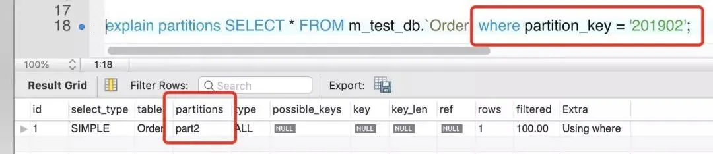
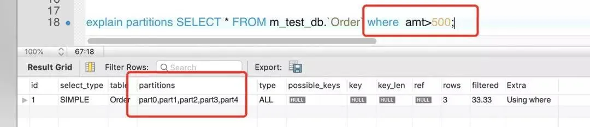

#### InnoDB逻辑存储结构
首先要先介绍一下InnoDB逻辑存储结构和区的概念，它的所有数据都被逻辑地存放在`表空间`，表空间又由`段`，`区`，`页`组成。


##### 段
>  `段`就是上图的`segment`区域，常见的段有`数据段`、`索引段`、`回滚段`等，在`InnoDB`存储引擎中，对`段`的管理都是由引擎自身所完成的。

##### 区

> `区`就是上图的`extent`区域，区是由连续的`页`组成的空间，无论`页`的大小怎么变，`区`的大小默认总是为`1MB`。


为了保证区中的`页`的连续性，`InnoDB`存储引擎一次从磁盘申请4-5个区，`InnoDB`页的大小默认为`16kb`，即一个区一共有64（1MB/16kb=16）个连续的`页`。

每个`段`开始，先用32页（page）大小的碎片页来存放数据，在使用完这些页之后才是64个连续页的申请。这样做的目的是，对于一些小表或者是undo类的段，可以开始申请较小的空间，节约磁盘开销。

##### 页

> `页`就是上图的`page`区域，也可以叫`块`。`页`是`InnoDB`磁盘管理的最小单位。默认大小为`16KB`，可以通过参数`innodb_page_size`来设置。

常见的页类型有：`数据页`，`undo页`，`系统页`，`事务数据页`，`插入缓冲位图页`，`插入缓冲空闲列表页`，`未压缩的二进制大对象页`，`压缩的二进制大对象页`等。

#### 分区概念

> 这里讲的分区，此“区”非彼“区”，这里讲的`分区`的意思是指将同一表中不同行的记录分配到不同的物理文件中，几个`分区`就有几个`.idb`文件，不是我们刚刚说的区。`MySQL`在5.1时添加了对水平分区的支持。

`分区`是将一个表或索引分解成多个更小，更可管理的部分。

每个`区`都是独立的，可以独立处理，也可以作为一个更大对象的一部分进行处理。这个是`MySQL`支持的功能，业务代码无需改动。要知道`MySQL`是面向`OLTP`的数据，它不像`TIDB`等其他`DB`。

那么对于分区的使用应该非常小心，如果不清楚如何使用分区可能会对性能产生负面的影响。

`MySQL`数据库的分区是局部分区索引，一个分区中既存了数据，又放了索引。也就是说，每个区的聚集索引和非聚集索引都放在各自区的（不同的物理文件）。目前`MySQL`数据库还不支持全局分区。

无论哪种类型的分区，如果表中存在主键或唯一索引时，分区列必须是唯一索引的一个组成部分。

#### 分区类型

目前`MySQL`支持一下几种类型的分区，`RANGE分区`，`LIST分区`，`HASH分区`，`KEY分区`。

如果表存在`主键`或者`唯一索引`时，分区列必须是唯一索引的一个组成部分。实战十有八九都是用RANGE分区。


##### RANGE分区

RANGE分区是实战最常用的一种分区类型，行数据基于属于一个给定的连续区间的列值被放入分区。

但是记住，当插入的数据不在一个分区中定义的值的时候，会抛异常。RANGE分区主要用于日期列的分区，比如交易表啊，销售表啊等。可以根据年月来存放数据。

如果你分区走的唯一索引中`date类型`的数据，那么注意了，优化器只能对`YEAR()`，`TO_DAYS()`，`TO_SECONDS()`，`UNIX_TIMESTAMP()`这类函数进行优化选择。实战中可以用`int`类型，那么只用存`yyyyMM`就好了。也不用关心函数了。

```code

CREATE TABLE `m_test_db`.`Order` (
  `id` INT NOT NULL AUTO_INCREMENT,
  `partition_key` INT NOT NULL,
  `amt` DECIMAL(5) NULL,
  PRIMARY KEY (`id`, `partition_key`))
 PARTITION BY RANGE(partition_key)
  PARTITIONS 5(
   PARTITION part0 VALUES LESS THAN (201901),  
   PARTITION part1 VALUES LESS THAN (201902),  
   PARTITION part2 VALUES LESS THAN (201903),  
   PARTITION part3 VALUES LESS THAN (201904),
   PARTITION part4 VALUES LESS THAN (201905)) ;

```

这时候我们先插入一些数据

```code

INSERT INTO `m_test_db`.`Order` (`id`, `partition_key`, `amt`) VALUES ('1', '201901', '1000');
INSERT INTO `m_test_db`.`Order` (`id`, `partition_key`, `amt`) VALUES ('2', '201902', '800');
INSERT INTO `m_test_db`.`Order` (`id`, `partition_key`, `amt`) VALUES ('3', '201903', '1200');

```

现在我们查询一下，通过EXPLAIN PARTITION命令发现SQL优化器只需搜对应的区，不会搜索所有分区


如果`sql`语句有问题，那么会走所有区。会很危险。所以分区表后，`select`语句必须走分区键。


##### LIST分区

`LIST分区`和`RANGE分区`很相似，只是`分区`列的值是`离散`的，不是连续的。`LIST`分区使用`VALUES IN`，因为每个分区的值是离散的，因此只能定义值。

##### HASH分区

说到哈希，那么目的很明显了，将数据均匀的分布到预先定义的各个分区中，保证每个分区的数量大致相同。

##### KEY分区

 KEY分区和HASH分区相似，不同之处在于HASH分区使用用户定义的函数进行分区，KEY分区使用数据库提供的函数进行分区。


 ### 分区和性能

 一项技术，不是用了就一定带来益处。比如显式锁功能比内置锁强大，你没玩好可能导致很不好的情况。

 分区也是一样，不是启动了分区数据库就会运行的更快，分区可能会给某些`sql`语句性能提高，但是分区主要用于数据库高可用性的管理。

 数据库应用分为2类，一类是`OLTP`（在线事务处理），一类是`OLAP`（在线分析处理）。

对于`OLAP`应用分区的确可以很好的提高查询性能，因为一般分析都需要返回大量的数据，如果按时间分区，比如一个月用户行为等数据，则只需扫描响应的分区即可。


在`OLTP`应用中，`分区`更加要小心，通常不会获取一张大表的10%的数据，大部分是通过索引返回几条数据即可。


比如一张表`1000w`数据量，如果一句`select`语句走`辅助索引`，但是没有走分区键。那么结果会很尴尬。

如果1000w的B+树的高度是3，现在有10个分区。那么不是要(3+3)* 10次的逻辑IO？（3次聚集索引，3次辅助索引，10个分区）。所以在OLTP应用中请小心使用分区表。

在日常开发中，如果想查看sql语句的分区查询结果可以使用`explain` `partitions` + `select sql`来获取，`partitions`标识走了哪几个分区。

```code


mysql> explain partitions select * from TxnList where startTime>'2016-08-25 00:00:00' and startTime<'2016-08-25 23:59:00';  
+----+-------------+-------------------+------------+------+---------------+------+---------+------+-------+-------------+  
| id | select_type | table             | partitions | type | possible_keys | key  | key_len | ref  | rows  | Extra       |  
+----+-------------+-------------------+------------+------+---------------+------+---------+------+-------+-------------+  
|  1 | SIMPLE      | ClientActionTrack | p20160825  | ALL  | NULL          | NULL | NULL    | NULL | 33868 | Using where |  
+----+-------------+-------------------+------------+------+---------------+------+---------+------+-------+-------------+  
1 row in set (0.00 sec)  

```
