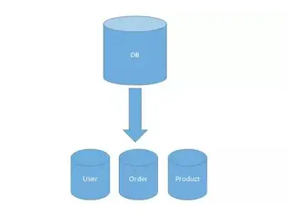
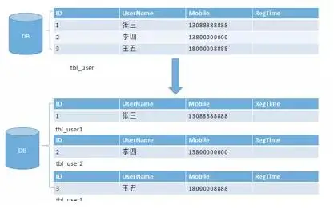
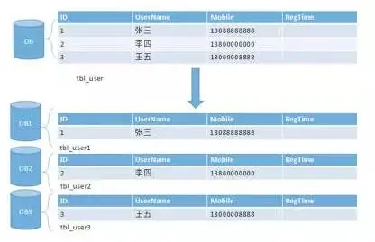

[大众点评订单系统分库分表实践](https://tech.meituan.com/2016/11/18/dianping-order-db-sharding.html)

[分库分表的几种常见形式以及可能遇到的难](https://www.infoq.cn/article/key-steps-and-likely-problems-of-split-table/)

垂直分表

> 垂直分表在日常开发和设计中比较常见，通俗的说法叫做大表拆小表，拆分是基于关系型数据库中的“列”（字段）进行的。**通常情况，某个表中的字段较多，可以新建立一张“扩展表”，将不经常使用或者长度较大的字段拆分出去放到“扩展表”中**

> 拆分字段的操作建议在数据库设计阶段就做好。如果是在发展过程中拆分，则需要改写以前的查询语句，会额外带来一定的成本和风险，建议谨慎。

垂直分库
> 垂直分库在“微服务”盛行的今天已经非常普及了。基本的思路就是按照业务模块来划分出不同的数据库，而不是像早期一样将所有的数据表都放到同一个数据库中。

> 系统层面的“服务化”拆分操作，能够解决业务系统层面的耦合和性能瓶颈，有利于系统的扩展维护。而数据库层面的拆分，道理也是相通的。与服务的“治理”和“降级”机制类似，我们也能对不同业务类型的数据进行“分级”管理、维护、监控、扩展等。

> 众所周知，数据库往往最容易成为应用系统的瓶颈，而数据库本身属于“有状态”的，相对于 Web 和应用服务器来讲，是比较难实现“横向扩展”的。数据库的连接资源比较宝贵且单机处理能力也有限，在高并发场景下，垂直分库一定程度上能够突破 IO、连接数及单机硬件资源的瓶颈，是大型分布式系统中优化数据库架构的重要手段。

> 然后，很多人并没有从根本上搞清楚为什么要拆分，也没有掌握拆分的原则和技巧，只是一味的模仿大厂的做法。导致拆分后遇到很多问题（例如：跨库 join，分布式事务等）。

水平分表
> 水平分表也称为横向分表，比较容易理解，就是将表中不同的数据行按照一定规律分布到不同的数据库表中（这些表保存在同一个数据库中），这样来降低单表数据量，优化查询性能。最常见的方式就是通过主键或者时间等字段进行 Hash 和取模后拆分。如下图所示：

> 水平分表，能够降低单表的数据量，一定程度上可以缓解查询性能瓶颈。但本质上这些表还保存在同一个库中，所以库级别还是会有 IO 瓶颈。所以，一般不建议采用这种做法。

水平分库分表
> 水平分库分表与上面讲到的水平分表的思想相同，唯一不同的就是将这些拆分出来的表保存在不同的数据中。这也是很多大型互联网公司所选择的做法。如下图：

> 某种意义上来讲，有些系统中使用的“冷热数据分离”（将一些使用较少的历史数据迁移到其他的数据库中。而在业务功能上，通常默认只提供热点数据的查询），也是类似的实践。在高并发和海量数据的场景下，分库分表能够有效缓解单机和单库的性能瓶颈和压力，突破 IO、连接数、硬件资源的瓶颈。当然，投入的硬件成本也会更高。同时，这也会带来一些复杂的技术问题和挑战（例如：跨分片的复杂查询，跨分片事务等）
