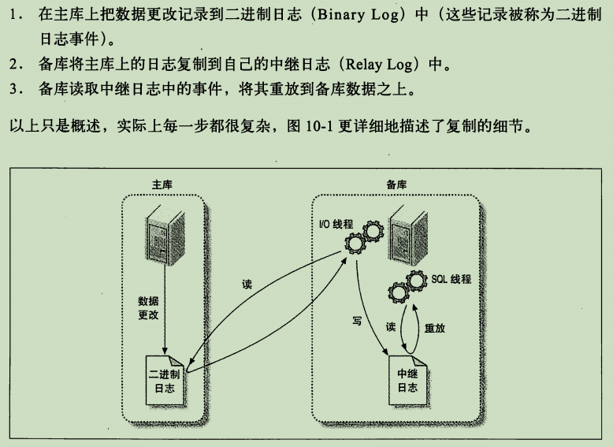
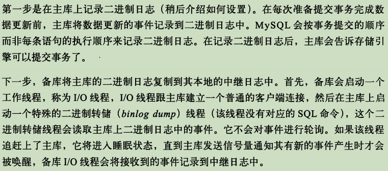
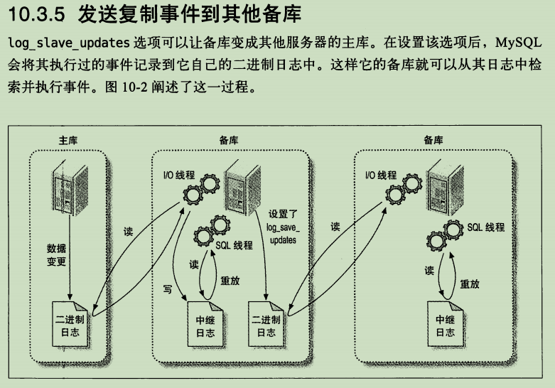
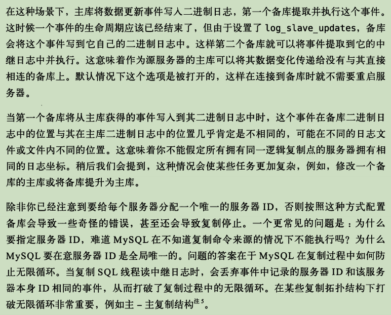

> 复制解决的基本问题是让一台服务器的数据与其他服务器保持同步。一台主库的数据可以同步到多台备库上，备库本身也可以被配置成另外一台服务器的主库。

MySQL支持两种复制方式：基于行的复制和基于语句的复制。

基于语句的复制（也成为逻辑复制）早在MySQL3.23版本中就存在，而基于行的复制方式在5.1版本中才被加入进来。

这两种方式都是通过在主库上记录二进制日志，在备库重放日志的方式来实现异步的数据复制。这就意味着，在同一时间点备库上的数据可能与主库存在不一致，并且无法保证主备之间的延迟。

### 如何工作

### 配置复制

### 复制的原理

- 基于语句的复制

> 在MySQL5.0及之前的版本中只支持基于语句的复制，也成为逻辑复制，在这数据库领域是很少见的。基于语句的复制模式下，主库会记录那些造成数据更改的查询，当备库读取并重放这些事件时，实际上只是把主库上执行过的SQL再执行一遍。

- 基于行的复制

> MySQL5.1开始支持基于行的复制，这种方式会将实际数据记录在二进制日志中。最大的好处是可以正确地复制每一行。

### 发送复制事件到其他备库

