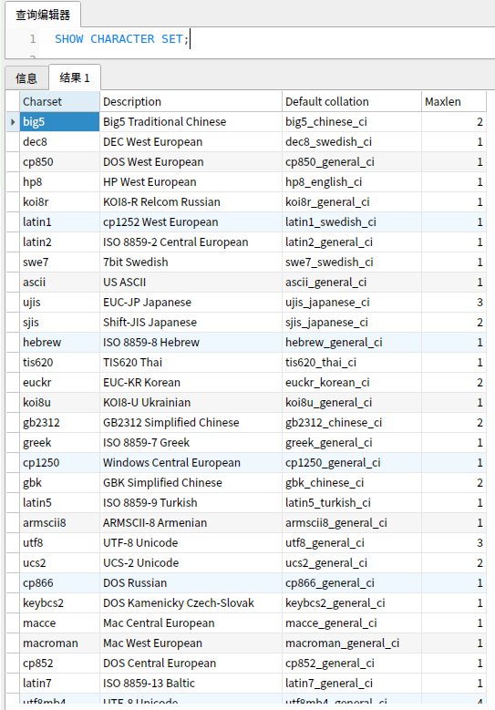
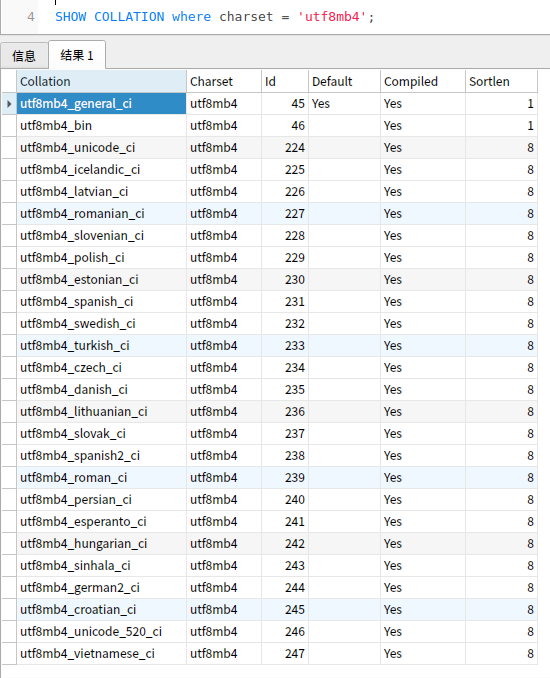

### 字符集

> 字符（Character）是各种文字和符号的总称，包括各国家文字、标点符号、图形符号、数字等。

> 字符集（Character set）是多个字符的集合，常见字符集名称：ASCII字符集、GB2312字符集、BIG5字符集、 GB18030字符集、Unicode字符集等。计算机要准确的处理各种字符集文字，就需要进行字符编码，以便计算机能够识别和存储各种文字。

> 字符编码（Character encoding）也称字集码，是把字符集中的字符通过编码成为指定集合中某一对象（例如：比特模式、自然数序列、8位组或者电脉冲），以便文本在计算机中存储和通过通信网络的传递。常见的例子包括将拉丁字母表编码成摩斯电码和ASCII。其中，ASCII将字母、数字和其它符号编号，并用7比特的二进制来表示这个整数。通常会额外使用一个扩充的比特，以便于以1个字节的方式存储。

**MySQL支持实例级别，数据库级别，表级别，字段级别等字符集设置。**

```mysql
//查看字符集
SHOW CHARACTER SET;
```



### 排列顺序

```mysql
//查看utf8mb4字符集对应的排序规则
SHOW COLLATION where charset = 'utf8mb4';
```



MySQL的排序规则（collation），一般指对字符集中字符串之间的比较、排序制定的规则， MySQL排序规则特征：
- 两个不同的字符集不能有相同的校对规则；
- 每个字符集有一个默认校对规则；
- 存在校对规则命名约定：以其相关的字符集名开始，中间包括一个语言名，并且以_ci（大小写不敏感）、_cs（大小写敏感）或_bin（二元）结束。


**字符集决定了能够存储哪些字符，比如 ASCII 字符集只能存储简单的英文、数字和一些控制字符；GB2312 字符集可以存储中文；Unicode 字符集能够支持世界上的各种语言。排序规则定义了字符集中字符的排序和比较顺序，包括是否区分大小写，是否区分重音等。**
