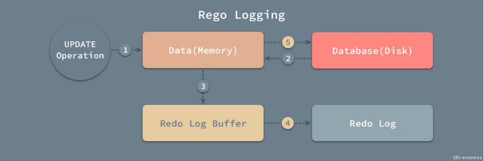

> 存储引擎就是指表的类型以及表在计算机上的存储方式。

### MyISAM
> mysql5.5之前版本默认存储引擎

> 不支持事务

> 存储结构：数据文件(.MYD),索引文件（.MYI）和结构文件(.frm)。可以在不同服务器上拷贝数据文件和索引文件。

> 加锁和并发。

1. 加锁：对整张表进行加锁，而不是行。
2. 在读数据的时候，所有的表上都可以获得共享锁(读锁)，每个连接都互不干扰。在写数据的时候，获得排他锁，会把整个表进行加锁，而其他的连接请求(读，写请求)都处于等待中。所以这就解释了为什么MyISAM的并发效率低，而读取效率高的原因。

> MyISAM表支持的索引类型

> MyISAM表支持数据压缩。压缩之后变成只读表。压缩之后，读取性能会更好。

> MyISAM表不支持外键

> 清空表的时候，MyISAM会重建表

> 在没有WHERE条件的情况下执行COUNT(*)操作，MyISAM只需要简单读出保存好的行数即可。


#### 适用场景
1. 非事务型应用
2. 只读类应用(数据压缩)
3. 空间类应用

### Innodb

> Innodb是一种事务型存储引擎

> 完全支持事务的ACID特性（Redo Log和Undo Log）

> mysql5.5之后版本默认存储引擎

> 存储结构：结构文件(.frm),数据文件(.ibd)

> Innodb使用表空间进行数据存储（独立表空间/系统表空间）'innodb_file_per_table'属性

> Innodb支持行级锁。行级锁可以最大程度的支持并发。行级锁是由存储引擎层实现的。

> 支持外键

https://draveness.me/mysql-innodb


#### InnoDB使用独立表空间存储与系统表空间存储区别
属性innodb_file_per_table  ON/OFF     数据存储文件不同

ON：独立表空间  tablename.ibd

OFF: 系统表空间  统一存放在ibdataX文件

区别：

  共享表空间：每一个数据库的所有表数据，索引文件全部放在一个文件中，默认在data目录下。默认ibdata，初始化10M。文件大小没有限制【64TB】。数据删除后，系统表空间大小不会改变，会造成磁盘空间浪费，产生大量磁盘碎片；会产生IO瓶颈

  独立表空间：每一个表都会生成以独立的文件方式来进行存储，每一个表都有一个.frm表来描述文件，.bid文件包含数据内容以及索引内容。独立表空间效率和性能会高点；可以实现单表在不同的数据库中移动；空间可以回收；可以同时向多个文件刷新数据；

#### 事务

> 一个最小的不可再分的工作单元；通常一个事务对应一个完整的业务

https://www.cnblogs.com/davygeek/p/7995072.html

#### 事务ACID特性

- 原子性（Atomicity）：一个事务必须被视为一个不可分割的最小工作单元，整个事务中的所有操作要么全部提交成功，要么全部失败回滚。
- 一致性（consistency）：事务执行完毕后将数据库从一个一致性状态转变成另一个一致性状态。
- 隔离性（isolation）：事务彼此独立，隔离的，即一个事务的执行不能被其他事务所干扰；一个事务所做的修改在最终提交之前，对于其他事务是不可见的。
- 持久性（durability）：一旦事务提交，则其所做的修改就会永久保存到数据库中。

#### 事务日志

事务日志可以帮助提高事务的效率。**使用事务日志，存储引擎在修改表的数据时只需要修改其内存拷贝，再把该修改行为记录到持久在硬盘上的事务日志中，而不用每次都将修改的数据本身持久到磁盘**。事务日志采用的是追加的方式，因此写日志的操作是磁盘上一小块区域内的顺序IO，而不像随机IO需要在磁盘的多个地方移动磁头，所以采用事务日志的方式相对来说要快得多。事务日志持久以后，内存中被修改的数据在后台可以慢慢地刷回到磁盘。通常称之为预写式日志（Write-Ahead Logging），修改数据需要写两次磁盘。

数据库通常借助日志来实现事务，常见的有redo log 重做日志 和 undo log 回滚日志。undo/redo log 能够保证事务特性，undo log实现事务原子性，redo log 实现事务的持久性。

###### 事务原子性：
事务的所有操作，要么全部完成，要不都不做，不能只做一半。如果在执行的过程中发生了错误，要回到事务开始时的状态，所有的操作都要回滚。

原理：
  Undo log 为了满足事务的原子性，在操作任何数据之前，首先将数据备份到Undo log中，然后进行数据的修改。如果出现了错误或者用户实行了rollback语句，系统可以利用Undo log中的备份数据恢复到事务开始之前的状态。


###### 事务持久性：

mysql使用重做日志redo log实现事务的持久性。
重做日志由两部分组成，一是内存中的重做日志缓冲区，因为重做缓冲区在内存中，所以它是易丢失的；另一个就是磁盘上的重做日志文件，它是持久的。



当我们在一个事务中尝试对数据进行修改时，它会先将数据从磁盘读入内存，并更新内存中缓存的数据，然后生成一条重做日志并写入重做日志缓存，当事务真正提交时，mysql会将重做日志缓存中的内容刷新到重做日志文件，再将内存中的数据更新到磁盘中。图中4,5步就是在事务提交时执行的。


###### 事务隔离级别：
- READ UNCOMMITTED(读未提交)：事务的修改，即使没有提交，对其他事务都是可见的。事务可以读取未提交的数据，也就是会产生脏数据。在实际应用中很少使用。
- READ COMMITEED（读已提交）：能够避免脏读问题，但是在一个事务里对同一条数据的多次查询可能会得到不同的结果，也就是会产生不可重复的问题。
- REPEATABLE READ（可重复读）：默认隔离级别；解决了脏读的问题。该级别保证了在同一个事务中多次读取同样记录的结果是一直的。
- SERIALIZABLE（可串行化）：该隔离级别最高，通过锁强制事务串行执行，避免了脏读幻读问题。但在高并发下，可能会导致大量的超时和锁争取问题。


## 并发控制器机制

- 锁
- 时间戳
- 多版本和快照隔离

### 什么是锁

> 锁对主要作用是管理共享资源的并发访问

> 锁用于实现事务的隔离性

### 锁的类型

1. 共享锁（也称读锁）
2. 独占锁（也称写锁，排他锁）

### 锁的粒度

1. 表级锁
2. 行级锁
3. 元数据锁

### 阻塞和死锁

> 阻塞 是因为不同锁之间的兼容性关系，在有些时刻一个事务中的锁需要等待另一个事务中的锁释放它占有的资源，这就是阻塞。阻塞并不是一件坏事，是为了保证事务可以并发并且正确的运行。

> 死锁 是指两个或两个以上的进程在执行过程中，因争取资源而造成的一种相互等待的现象，若无外力作用，他们都将无法推进下去。此时称系统处于死锁状态或系统产生了死锁，这些永远在相互等待的进程成为死锁进程。表级锁不会产生死锁，死锁常见于Innodb存储引擎。解决方案：1.通过innodb_lock_wait_timeout来设置；2.发现死锁后，主动回滚死锁链条中的某个事务，让其他事务得以继续执行，再重新执行因死锁被回滚的事务即可；将参数innodb_deadlock_detect设置为on，表示开启这个逻辑。

减少死锁的主要方向，就是`控制访问相同资源的并发事务量`。


### 时间戳


> 使用时间戳实现事务的隔离性时，往往都会使用乐观锁，先对数据进行修改，在写回时再判断当前值，也就是时间戳是否被改变过，如果没有改变过，就写入，否则，生成一个新的时间戳并在此更新数据，乐观锁其实并不是真正的锁机制，它只是一种思想。

```mysql

update tbl_product set sales = 5 + 1 where product_id = 1 and sales = 5;

```

在`set`写回的时候，加上初始状态的条件compare，只有初始状态不变时，才允许`set`写回成功，`Compare And Set(CAS)`，是一种常见的降低读写锁冲突，保证数据一致性的方法。
