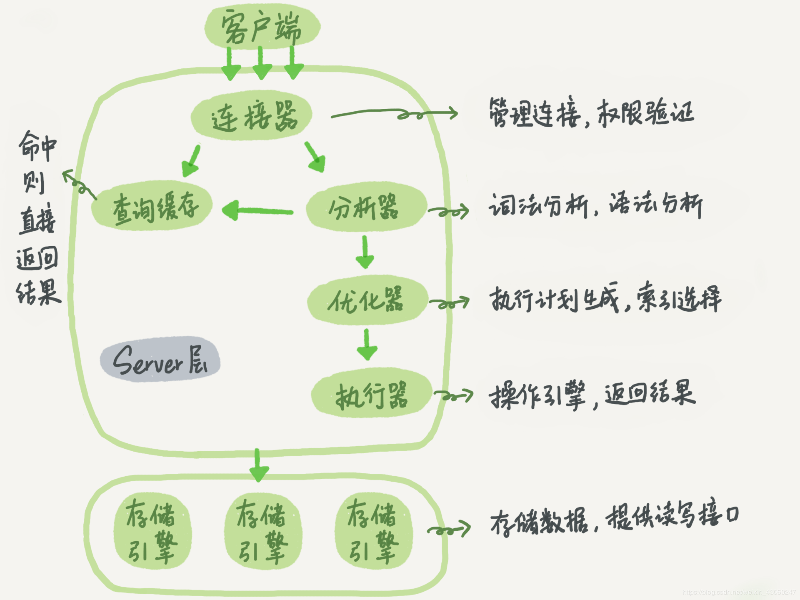

#### 一条SQL查询语句是如何执行的




MySQL可以分为Server层和存储引擎层两部分。

1. Server层包括`连接器`，`查询缓存`，`分析器`，`优化器`，`执行器`等，涵盖MySQL的绝大多数核心功能，以及所有的函数(包括日期，时间，数据和加密函数等)，所有跨存储引擎的功能都在这一层实现，比如储存过程，触发器，视图等。

2. 存储引擎层负责数据的存储与提取。常用的存储引擎是InnoDB，为MySQL的默认存储引擎。


##### 连接器

负责处理客户端与MySQL服务器的连接。

客户端和服务器的连接使用的是TCP协议，在完成TCP握手之后，连接器开始进程身份认证。

如果用户名或密码不对，那么连接器会抛出一个 "Access denied for user"的错误，客户端结束执行。

如果用户名密码认证通过，那么连接器会到权限表中查出账号拥有的权限。以后所有的权限判断都是基于此时查出的权限。这意味着，一个用户成功建立连接后，即使root用户修改了这个用户的权限，对之前的连接也不能生效。只有修改之后生成的连接才能获取到新的权限。

连接建立成功后，如果长时间没有操作，连接器会自动断开连接。断开连接的时间是由wait_timeout控制的，默认值是8小时。

如果连接被断开后，客户端再次发生请求，会收到“Lost connection to MySQL server during query”的错误提示。这时候想要执行查询，就需要重连了。

使用show processlist 可以查看系统所有连接的信息。其中Command 列表示 连接的状态，“Sleep” 表示 连接是一个空间的连接，没有进行操作。

mysq的长连接是指连接成功后，客户端有持续的请求，使用的一直是同一个连接。短连接是指每次执行完少量的操作后就断开连接，下次使用在重新建立连接。

但是使用长连接，会存在占用内存大的问题。这是因为在长连接中申请的临时内存会一直存在，只有当连接断开的时候才释放。

解决长连接占用内存大的问题有两个方法 1）定期断开长连接，清除长连接占用的内存。 2） mysql 5.7 或者更高的版本，可以执行 mysql_reset_connection 来重新初始化连接。这个过程不需要重新建立连接，但是会释放占用的临时内存，将连接恢复到刚刚创立连接的状态。


##### 查询缓存
通过下面语句查看`查询缓存`是否开启
```bash

show variables like 'query_cache%';

```
`query_cache_size`：预留缓存空间大小

`query_cache_type`：是否有开启缓存

mysql服务器提供的，用于缓存select语句结果的一种内部内存缓存系统。

如果开启了查询缓存，将所有的查询结果，都缓存起来，使用同样的select语句，再次查询时，直接返回缓存的结果即可。

MySQL查询缓存保存查询返回的完整结果。当查询命中该缓存，MySQL会like返回结果，跳过了解析、优化和执行截断。

查询缓存系统会跟踪查询中涉及的每个表，如果这些表发生变化，那么和这个表相关的所有的缓存数据都将失效。

查询语句、当前要查询的数据库、客户端协议的版本等一些其他可能会影响返回结果的信息。

> Mysql5.6以来，默认禁用查询缓存；8.0版本废弃了查询缓存。

建议在应用程序端进行缓存处理，例如Redis


##### 分析器

对sql语句做解析。

1. 词法分析

    扫描字符流，根据构词规则识别单个单词。

    mysql使用Flex来生成词法扫描程序

    在sql/lex.h中定义了MySQL关键字和函数关键字，用两个数组存储

2. 语法分析

    在词法分析的基础上将单词序列组成语法短语，最后生成语法树，提交给优化器

    语法分析器使用Bison，在sql/sql_yacc.yy中定义了语法规则。

    根据关系代数理论生成语法树


##### 查询优化器

查询优化器的任务是发现执行SQL查询的最佳方案。


优化器是在表里面有多个索引的时候，决定使用哪个索引；

在一个语句有多表关联（join）的时候，决定各个表的连接顺序


#####  执行器

首先判断对操作表有没有权限，如果有权限就执行调用存储引擎的 api 接口获取数据，如果没有权限就报错。


https://zhuanlan.zhihu.com/p/21536752390