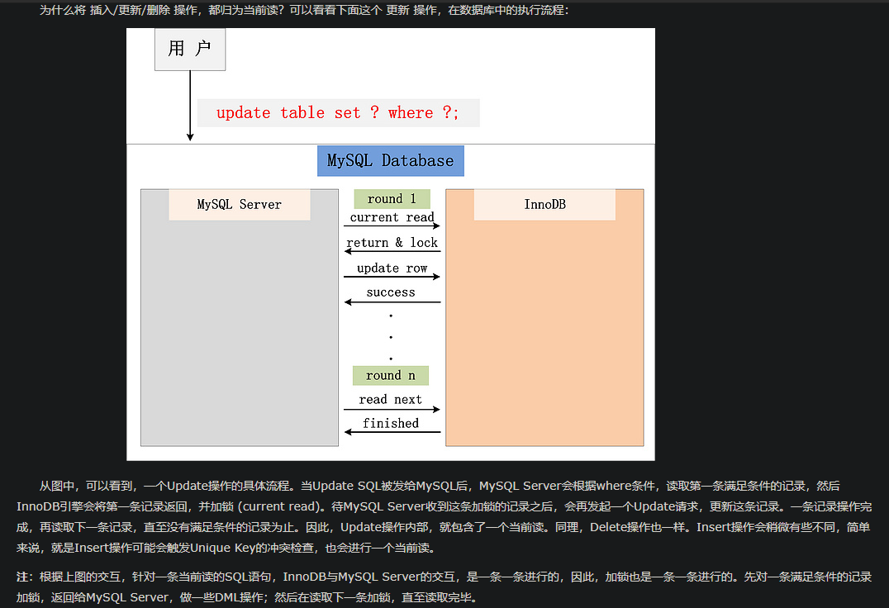
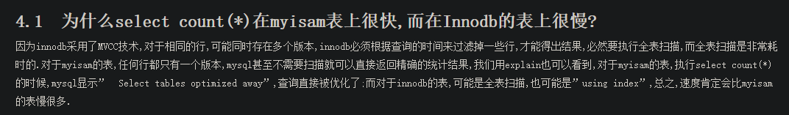
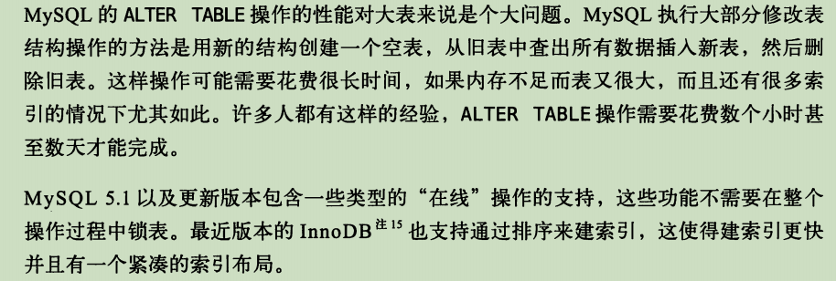

### 1. MySQL 是否有需要使用外键

- 外键可以保证数据的完整性和一致性，但是同时也会带来一些问题
- MySQL需要额外的开销来检测数据的完整性和一致性，容易造成死锁，MySQL处理性能势必会下降
- 增加额外的索引消耗


### 2. CAS乐观锁

> 乐观锁与悲观锁都是逻辑上的锁。本质上就是基于验证的协议

> 乐观锁假设认为数据一般情况下不会造成冲突，所以在数据进行提交更新的时候，才会正式对数据的冲突与否进行检测，如果发生了冲突，则返回错误信息，让用户决定如何去做。


```mysql

select sales from tbl_product where product_id = 1;//sales = 5;

//TODO

update tbl_product set sales = 5 + 1 where product_id = 1 and sales = 5;

```

在极限情况下仍然有几率会出现ABA问题。

#### 2.1 悲观锁

> 悲观锁，悲观地认为并发问题极易发生，所以每次操作，都会对记录加锁，以防止其他线程对数据进行修改。


### 3. ABA问题

> 线程1与线程2同时读取到一个变量V，线程1需要把变量V的值修改成A，线程2需要把变量V修改成B后，发生了意外，把B变回了A，此时线程1发现V的值还是A，所以继续执行，但是此A非彼A。这就是ABA问题。


解决方案：引入版本号（时间戳）对比

乐观锁每次在执行数据的修改操作时，都会带上一个版本号，一旦版本号和数据的版本号一致就可以执行修改操作并对版本号执行+1操作，否则就执行失败

优化后：

```mysql

select sales,version from tbl_product where product_id = 1;//sales = 5;version=10086

//TODO

update tbl_product set sales = 5 + 1,version = 10086 + 1  where product_id = 1 and version = 10086;

```

### 4. 幂等性

> 相同条件下，执行同一请求，得到的结果相同，才符合幂等性。


### 5.并发操作问题

> 多个事务交错执行时，可能出现不一致问题，这也称为并发操作问题。

- 丢失更新

> 设有两个事务T1和T2，当它们同时读入同一数据并加以修改时，事务T2的提交结果会破坏事务T1提交的结果，因此导致事务T1的修改被丢失。

- 不可重复读

> 设有两个事务T1和T2，不可重复读是指事务T1读取数据后，事务T2执行更新操作，使事务T1无法再现前一次读取结果。通常，不可重复读包括三种情况。

1. 事务T1读取某一数据后，事务T2对其做了修改，当事务T1再次读该数据时，得到与前一次不同的值。
2. 事务T1按一定条件从数据库中读取了某些数据后，事务T2删除了其中部分记录，当事务T1再次按相同条件读取数据时，发现某些记录神秘地消失了。
3. 事务T1按一定条件从数据库中读取某些数据记录后，事务T2插入了一些记录，事务T1再次按相同条件读取数据时，发现多了一些记录。

- 读“脏”数据

> 设有两个事务T1和T2，读”脏“数据是指，事务T1修改某一数据，并将其写回磁盘，事务T2读取同一数据后，事务T1由于某种原因被撤销，这时事务T1已修改过的数据恢复原值，事务T2读取的数据就与数据库中的数据不一致，则事务T2读到数据就为”脏“数据，即不正确数据。

产生上述三类数据不一致的主要原因是`并发操作破坏了事务的隔离性`。并发控制机制就是要正确的方式调度并发操作，是一个用户事务的执行不受其他事务的干扰，从而避免造成数据不一致。

解决并发操作所带来的数据不一致性问题的方法有`封锁`，`时间戳`，`乐观控制法`和`多版本并发控制`等。


##### 5.1 封锁

> 需要时，事务通过系统请求对它锁希望的数据对象（如数据库中的记录）加锁，以确保它不被非预期改变。


> 一个锁实际上就是允许或阻止一个事务对一个数据对象的存取特权。一个事务对一个数据对象加锁的结果是将别的事务”封锁“在该对象之外，特别是防止了其他事务对该对象的变更，而加锁的事务则可执行它所希望的处理并为止该对象的正确状态。

###### 5.1.1 锁类型


排他锁（Exclusive Lock，X锁）和 共享锁（Shared Lock，S锁）写操作要求X锁，读操作S锁

- 共享锁

  1. 当前线程对共享资源加共享锁，其他线程可以读取此资源，可以继续追加共享锁，但是`不能修改此资源`，`不能追加排它锁`
  2. 语法
    ```mysql

      select * from t lock in share mode;

    ```

- 排他锁

  1. 当前线程对共享资源加排它锁，其他线程不允许读取次资源，不允许追加共享锁，不允许修改此资源，不允许追加排它锁。
  2. 语法
    ```mysql

      update t_table set a =1; // 数据库的增删改操作默认都会加排他锁

      select * from t_table for update;// for update也是一种增删改

    ```
  3. `InnoDB引擎`默认的`修改数据`类SQL语句，`UPDATE`,`DELETE`,`INSERT`等，都会自动给涉及到的数据加上排他锁。


###### 5.1.2 时间戳


###### 5.1.3 乐观控制法

见上。

###### 5.1.4 多版本并发控制-MVCC

> MVCC：Multi-Version Concurrent Control 多版本并发控制

> MVCC 是为了实现数据库的并发控制而涉及的一种协议。它的最大好处就是，`读不加锁，读写不冲突`。

> 这项技术`使得InnoDB的事务隔离级别下执行一致性读操作有了保证`。保证了在同一个事务中多次读取相同的数据返回的结果是一样的，解决了不可重复读的问题。它使得大部分支持行锁的事务引擎，不再单纯的使用行锁来进行数据库的并发控制，取而代之的是，把数据库的行锁与行的多个版本结合起来，只需要很小的开销，就可以实现非锁定读，从而大大提高数据库系统的并发性能。

Innodb的MVCC，是通过在`每行记录后面保存两个隐藏的列来实现的`。这两个列，`一个保存了行的创建时间`，`一个保存行的过期时间（或删除时间）`。当然存储的并不是实际的时间值，而是系统版本号。每开始一个新的事务，系统版本号都会自动递增。事务开始时刻的系统版本号会作为事务的版本号，用来和查询到的每行记录的版本号进行比较。

InnoDB会根据以下两个条件检查每行记录：

a. InnoDB只查找版本早于当前事务版本的数据行（也就是，行的系统版本号小于或等于事务的系统版本号），这样可以确保事务读取的行，要么是在事务开始前已经存在，要么是事务自身插入或者修改过的。

b. 行的删除版本要么未定义，要么大于当前事务版本号。这可以确保事务读取到的行，在事务开始之前未被删除。

在MVCC中，读操作可以分成两类，快照读（Snapchat Read）和 当前读（Current Read）。

- 快照读，读取的是记录的可见版本（可能是历史版本，即最新的数据可能正被当前执行的事务并发修改），不会对返回的记录加锁。
- 当前读，读取的是记录的最新版本，并且会对返回的记录加锁，保证其他事务不会并发修改这条记录。

MVCC只在REPEATABLE READ 和  READ COMMITTED两个隔离级别下工作。

`普通的SELECT就是快照读，不会加锁，而UPDATE、DELETE、INSERT、SELECT ...  LOCK IN SHARE MODE、SELECT ... FOR UPDATE是当前读。`



https://www.jianshu.com/p/9025acd9b094

https://www.cnblogs.com/xibuhaohao/p/11065350.html

https://draveness.me/database-concurrency-control

https://www.cnblogs.com/crazylqy/p/7611069.html


### 6. Innodb引擎的表只支持行锁也不支持表锁？

实际上这种说法不严谨，行锁和表锁是在存储引擎实现的；Innodb既支持行级锁，也支持表级锁，默认是行级锁；

1. `ALTER TABLE ` 会触发表锁。（不全是，修改默认值时不会）
2. `update t set b='x' where a1=2;` 当`a1`字段没有索引时，该sql语句将升级为表锁。行锁的实现SQL语句没有索引限制条件会变成.


### 7. 索引是不是越多越好

- 索引会增加写操作成本
> 由于在进行数据更新，插入，删除的同时要对相关的索引进行维护，索引越多，修改时间就会越长

- 太多的索引会增加查询优化器的选择时间

### 8. 幻读

```mysql

users： id 主键

1、T1：select * from users where id = 1;

2、T2：insert into `users`(`id`, `name`) values (1, 'big cat');

3、T1：insert into `users`(`id`, `name`) values (1, 'big cat');

```

> mysql 的幻读并非什么读取两次返回结果集不同，而是事务在插入先检测不存在的记录时，惊奇地发现这些数据已经存在了，之前的检测读取到的数据如同鬼影一般。


### 9.类型对比



### 10.金额字段类型选decimal还是int


### 11.关于int(1)和int(20)的存储范围


### 12.关于日期类型选择DATETIME还是TIMESTAMP


`一定不要使用INT存储啊。。。巨麻烦`


### 13.大表ALTER TABLE问题



### 14. 连表优化
https://www.cnblogs.com/jpfss/p/9167133.html

### 15. 主键过长问题

https://mp.weixin.qq.com/s/JwrXkr0RirqLMRHLtk6INQ

自增主键还是uuid作为主键？


> innodb中，主键尽可能短，最好是有序的。短主要是从空间角度考虑，这样`二级索引的叶子节点所占用的空间小`。有序是从时间角度考虑，无序会导致移动，甚至页分裂。页分裂又会导致50/50问题，又回到空间利用率上面了。

自增id与业务无关，只用来做主键

### 16. MySQL自增ID用完了没怎么办

当自增ID达到了int类型的最大值时，再次插入数据，自增ID还是4294967295，报主键冲突错误。

建议使用bigint unsigned类型，可以应付绝大部分的使用场景。


### 17. MySQL表知否需要自增ID主键

在创建表的时候，如果没有显式声明主键，这种情况`InnoDB`会自动帮你创建一个不可见的，长度为6个字节的row_id，而且`InnoDB`维护了一个全局的`idctsys.row_id`，所以未定义主键的表都共享该`row_id`，每次插入一条数据，都把全局`row_id`当成主键id，然后全局`row_id`+1

该全局row_id在代码上使用的是bigint unsigned类型，但实际上只给row_id保留了6字节，这种设计会存在一个问题，但全局row_id达到2的48幂次方-1时，再+1，row_id的低48位都为0，结果在插入新一行时，拿到的row_id就为0，`存在主键冲突的可能性`。

`所以建议，每个表都要维护一个主键`
