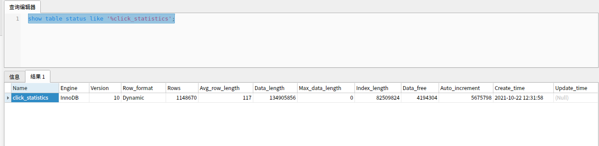
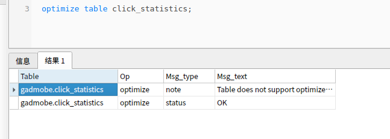
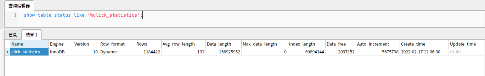

### OPTIMIZE 命令

#### 共享表空间和独立表空间

###### 共享表空间
> 指的是数据库的所有的表数据，索引文件全部放在一个文件中，默认这个共享表空间的文件路径在 data 目录下。

###### 独立表空间
> 每一个表都将会生成以独立的文件方式来进行存储。 共享表空间和独立表空间最大的区别是如果把表放再共享表空间，即使表删除了空间也不会删除，所以表依然很大，而独立表空间如果删除表就会清除空间

#### OPTIMIZE使用场景

> 当对MySQL进行大量的增删改操作的时候，很容易产生一些碎片，这些碎片占据着空间，所以可能会出现删除很多数据后，数据文件大小变化不大的现象。当然新插入的数据仍然会利用这些碎片。但过多的碎片，对数据的插入操作是有一定影响的，此时，我们可以通过optimize来对表的优化。

> 针对MySQL的不同数据库存储引擎，在optimize使用清除碎片，回收闲置的数据库空间，把分散存储（fragmented）的数据和索引重新挪到一起(defragmentation)，对I/O速度有好处。
当然**OPTIMIZE在对表进行操作的时候，会加锁**，所以不宜经常在程序中调用。

#### 实际操作

> 命令show table status [like table_name]来查看数据碎片

Data_free 代表数据碎片

OPTIMIZE后再看Data_free,有明显的变化

