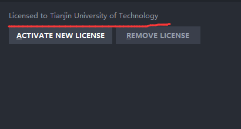
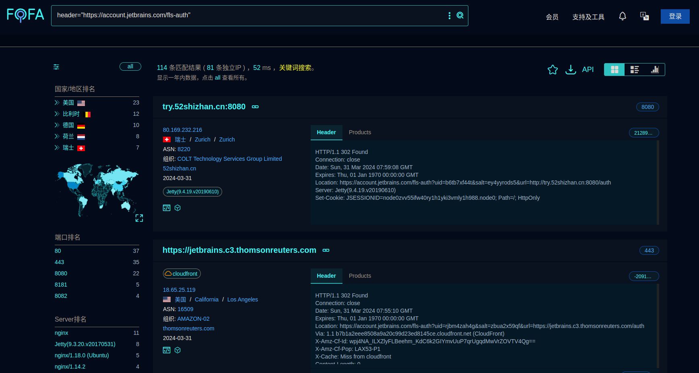

#### 通过censys
https://search.censys.io/

主要用到的代码

```code
services.http.response.headers.location: account.jetbrains.com/fls-auth

```

复制后再censys进行搜索。

可以看到出现了很多对应跳转到 jetbrains 的服务器IP和网址,我们随便点击一个看下状态是不是 302 只有 302 的才能 正常使用


然后我们复制域名或者IP到jetbrains全家桶进行激活,比如我们使用第一个 49.234.70.205 复制到 License server 。


　可以看到已经连接到jetbrains授权服务器成功了,然后我们点击 ACTIVATE 进行启动就可以了。


#### 通过shodan
https://www.shodan.io/

主要用到的代码
```code
Location: https://account.jetbrains.com/fls-auth
```


通过shodan我们可以直接看到 HTTP/1.1 302 不用再每个都要点进去看了,相对来说比方式一方便。


激活使用jetbrains全家桶方式和censys一样,激活之后我们可以看到用的是 天津理工大学 的 jetbrains授权服务器 。




#### 通过Fofa

主要用到的代码
```code
header="https://account.jetbrains.com/fls-auth"
```
https://fofa.info/result?qbase64=aGVhZGVyPSJodHRwczovL2FjY291bnQuamV0YnJhaW5zLmNvbS9mbHMtYXV0aCI%3D


