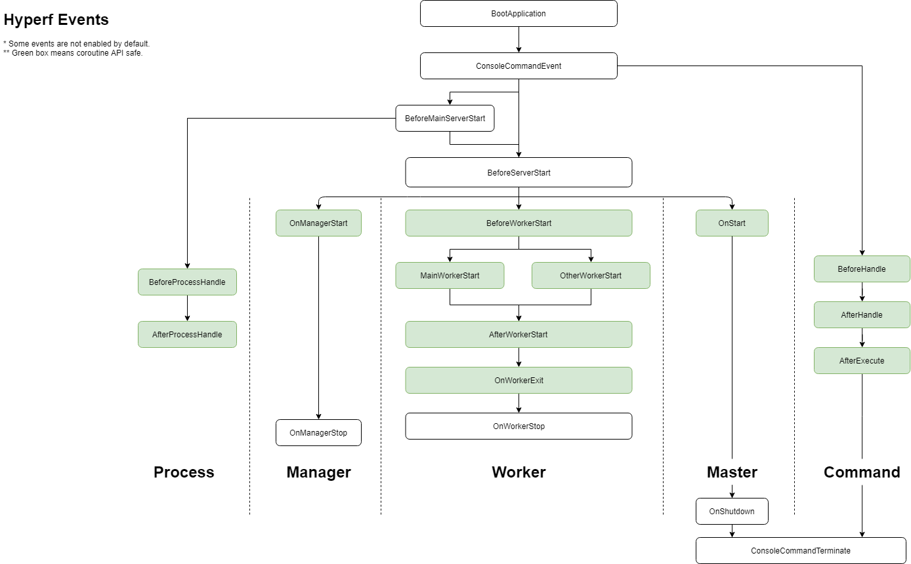

对于一串消息流，我们必须能确定消息边界，提取出单条消息的字节流片段，然后对这个片段按照一定的规则进行反序列化来生成相应的消息对象。
每个消息都有其内部字段结构，结构构成了消息内部的逻辑规则，程序要按照结构规则来决定字段序列化的顺序。

#### 消息边界
RPC 需要在一条 TCP 链接上进行多次消息传递。在连续的两条消息之间必须有明确的分割规则，以便消息接收方可以将消息分割开来。

比较常用的两种分割方式是特殊分割符法（可读性强）和长度前缀法（传输便捷）。
https://cdn.learnku.com/uploads/images/201811/01/21374/vnJT9sxs3J.png!large

