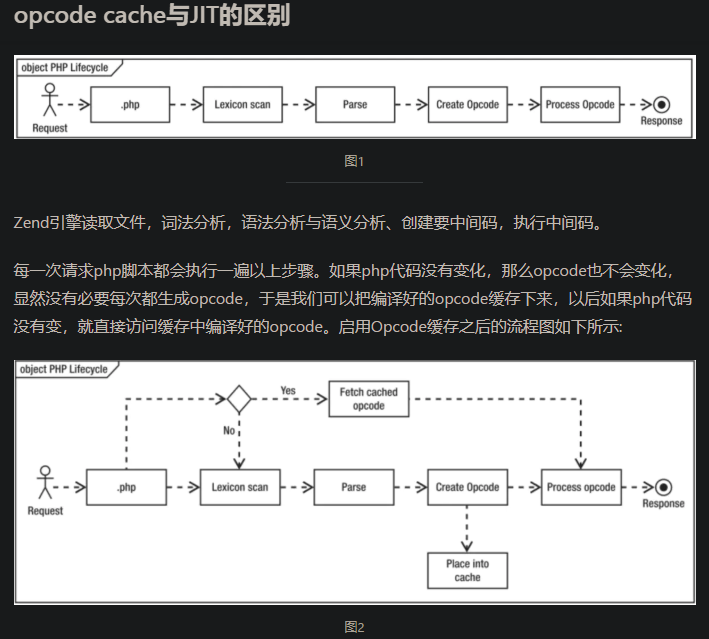
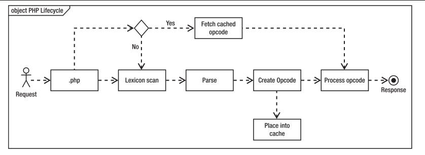

### 机器码

> 学名机器语言指令，有时也被成为原生码(Native Code),是电脑的CPU可直接读取的数据。

机器码是电脑CPU直接读取运行的机器指令，运行速度最快，但是非常晦涩难懂，也比较难写，一般从业人员接触不到。

而且机器码不支持跨平台，简单点说就是不同的CPU使用的机器码不一样。

### 字节码 bytecode
> 是一种包含执行程序，由一系列op代码/数据对 组成的二进制文件。字节码是一种中间码，它比机器码更抽象，需要直译器转译后才能成为机器码的中间代码。

字节码主要为了实现特定软件运行和软件环境，与硬件环境无关。字节码的实现方式是通过编译器和虚拟机器。编译器将源码编译成字节码，特定平台上的虚拟器将字节码转译为可以直接执行的指令。字节码的典型应用为Java bytecode，那PHP的就是opcode。

字节码在运行时通过虚拟机(PHP 的Zend虚拟机)做一次转换，生成机器指令，因此能够更好地跨平台运行。

字节码是一种中间状态(中间码)的二进制代码(文件)。需要直译器转译后才能成为机器码。

通过介绍我们可以看到，CPU只能执行机器码，但为了实现应用跨硬件平台，我们就为了不同的编程语言实现了一个虚拟机，而这个虚拟机将我们写的代码编译成二进制代码，这个二进制代码就叫字节码，也叫中间码。Zend虚拟机编译好的字节码就叫opcode

### JIT

> JIT 是 just in time 的缩写，也就是即时编译编译器。使用即时编译器技术，能够加速PHP程序执行速度。

通常编译时与运行时两个阶段是独立分开的，脚本编译完成后，像 APC 与 OPCache 这样的字节码缓存组件会缓存这些操作码。而 JIT 去掉了编译时阶段，它将这编译时与运行时两个阶段合为一体，实现即时编译与执行。

JIT 是一种编译器策略，它将代码表述为一种中间状态，在运行时将其转换为依赖于体系结构的机器码，并即时执行。在 PHP 中，这意味着 JIT 将为 Zend VM 生成的指令视为中间表述，并以依赖于体系结构的机器码执行，也就是说托管代码的不再是 Zend VM，而是更为底层的 CPU。

另外值得一提的是，PHP JIT 对于使用 PHP 的网站来说提速可能并不明显，因为 JIT 在 CPU 密集型的代码上效果最好，而一般情况下，用 PHP 编写的程序都是 I/O 密集型的。

简单来说就是，PHP 程序往往受限于 I/O 而不是 CPU，使 PHP 代码运行速度变慢的因素往往是它们正在执行的 I/O 操作，包括连接、读取和写入数据库、高速缓存、文件与套接字等。

JIT 把翻译过的机器码保存起来，以备下次使用(这里面肯定有个类似与LRU的算法)。可见JIT要做的很简单，就是把中间码翻译成的机器码暂时(保存多久，怎么选择这里不做介绍)保存起来，这样再用到这个机器码的时候，就少了一次翻译。

### opcode cache

> 将中间码opcode缓存起来

**Zend引擎必须从文件系统读取文件、扫描其词典和表达式、解析文件、创建要执行的计算机代码（称为Opcode），最后执行Opcode。每一次请求PHP脚本都会执行一遍以上步骤，如果PHP源代码没有变化，那么Opcode也不会变化，显然没有必要每次都重行生成Opcode，结合在Web中无所不在的缓存机制，我们可以把Opcode缓存下来，以后直接访问缓存的Opcode岂不是更快，启用Opcode缓存之后的流程图如下所示：**

### 总结

**简单点描述JIT是用来缓存CPU执行的机器码的，opcode cache是用来缓存Zend虚拟机用的中间码的。**
