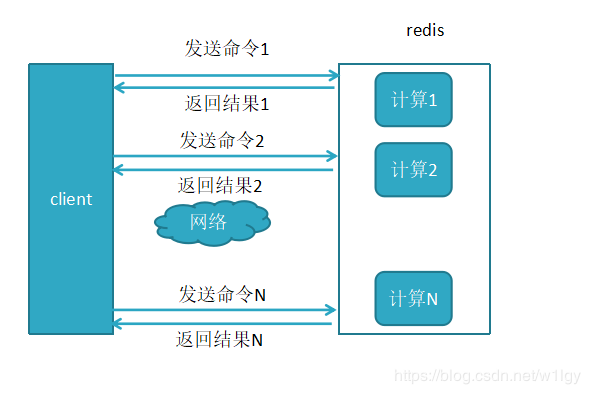
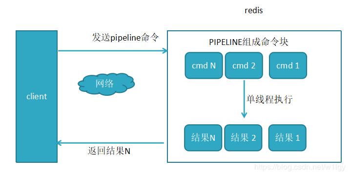
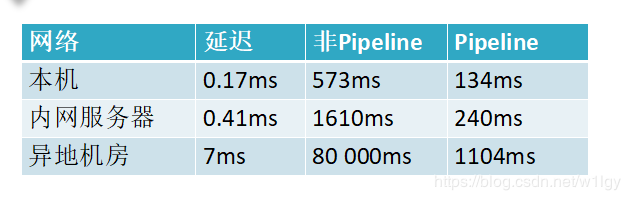

redis客户端执行一条命令分为4个过程:

> 发送命令 -> 命令排队 -> 命令执行 -> 返回结果

这个过程称为**Round trip time(简称RTT, 往返时间)**，mget mset有效节约了RTT，但大部分命令（如hgetall，并没有mhgetall）不支持批量操作，需要消耗N次RTT ，这个时候需要pipeline来解决这个问题

##### 未使用pipeline 执行N条命令

##### 使用pipeline 执行N条命令

##### 两者性能对比

小结：这是一组统计数据出来的数据，使用Pipeline执行速度比逐条执行要快，特别是客户端与服务端的网络延迟越大，性能体能越明显。

#### 原生批命令(mget,mset)与pipeline对比
1. 原生批命令是原子性，pipeline是非原子性

2. 原生批命令是服务端实现，pipelinee需要服务端和客户端共同完成(客户端对pipeline命令进行命令打包，服务端对pipeline命令对数据包进行拆分执行)
3. pipeline每次只能作用在一个Redis节点上
