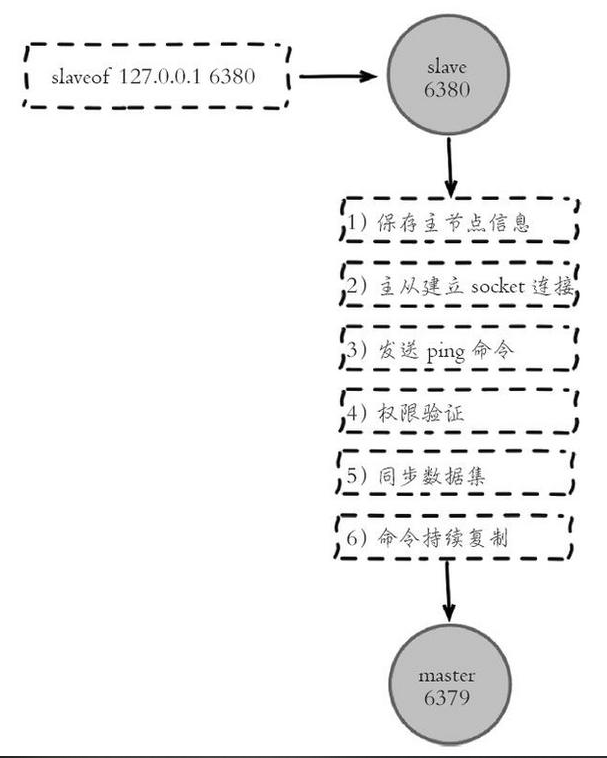
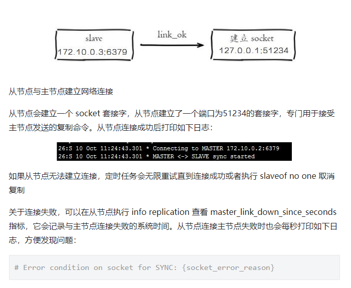
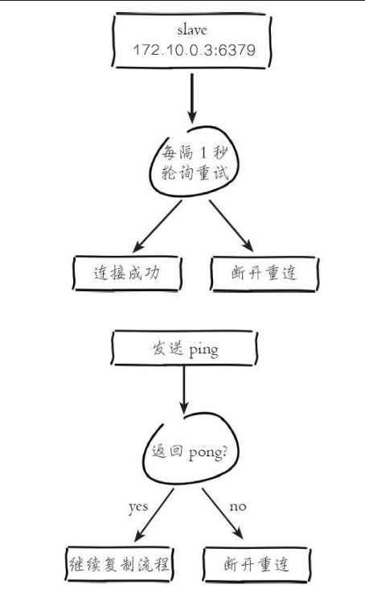

##### 概念
> Redis 为了解决这个单一节点的问题，也会把数据复制多个副本部署到其他节点上进行复制，实现 Redis的高可用，实现对数据的冗余备份，从而保证数据和服务的高可用。

#### 主从复制

> 主从复制，是指*将一台Redis服务器的数据，复制到其他的Redis服务器*。前者称为主节点(master)，后者称为从节点(slave),数据的复制是单向的，只能由主节点到从节点。

> 默认情况下，每台Redis服务器都是主节点；且一个主节点可以有多个从节点(或没有从节点)，但一个从节点只能有一个主节点。

#### 主从复制的作用

1. 数据冗余：主从复制实现了数据的热备份，是持久化之外的一种数据冗余方式。
2. 故障恢复：当主节点出现问题时，可以由从节点提供服务，实现快速的故障恢复；实际上是一种服务的冗余。
3. 负载均衡：在主从复制的基础上，配合读写分离，可以由主节点提供写服务，由从节点提供读服务（即写Redis数据时应用连接主节点，读Redis数据时应用连接从节点），分担服务器负载；尤其是在写少读多的场景下，通过多个从节点分担读负载，可以大大提高Redis服务器的并发量。
4. 读写分离：可以用于实现读写分离，主库写、从库读，读写分离不仅可以提高服务器的负载能力，同时可根据需求的变化，改变从库的数量；
5. 高可用基石：除了上述作用以外，主从复制还是哨兵和集群能够实施的基础，因此说主从复制是Redis高可用的基础。

#### 主从复制过程

主从复制过程大体可以分为3个阶段：连接建立阶段（即准备阶段）、数据同步阶段、命令传播阶段。

在从节点执行 slaveof 命令后，复制过程便开始运作，下面图示大概可以看到，

从图中可以看出复制过程大致分为6个过程

1. 保存主节点（master）信息。
2. 从节点（slave）内部通过每秒运行的定时任务维护复制相关逻辑，当定时任务发现存在新的主节点后，会尝试与该节点建立网络连接

3. 发送 ping 命令。
连接建立成功后从节点发送 ping 请求进行首次通信，ping 请求主要目的如下：

·检测主从之间网络套接字是否可用。

·检测主节点当前是否可接受处理命令。

如果发送 ping 命令后，从节点没有收到主节点的 pong 回复或者超时，比如网络超时或者主节点正在阻塞无法响应命令，从节点会断开复制连接，下次定时任务会发起重连。

4. 权限验证。如果主节点设置了 requirepass 参数，则需要密码验证，从节点必须配置 masterauth 参数保证与主节点相同的密码才能通过验证；如果验证失败复制将终止，从节点重新发起复制流程。
5. 同步数据集。主从复制连接正常通信后，对于首次建立复制的场景，主节点会把持有的数据全部发送给从节点，这部分操作是耗时最长的步骤。
6. 命令持续复制。当主节点把当前的数据同步给从节点后，便完成了复制的建立流程。接下来主节点会持续地把写命令发送给从节点，保证主从数据一致性。
