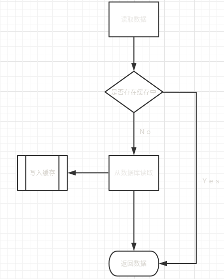

通常，缓存同步方式有一下三种：

##### Cache Aside

是最常用，最简单，最容易实现的方式。适用于轻量级的应用，缓存的使用场景不多，也不想花费太多成本进行开发维护。

注：`写入缓存`的中[常见的问题](./常见问题.md)见问题

缺点：需要自己维护数据跟新后的同步逻辑，对业务代码有侵入。

##### Read/Write Through

把缓存和数据库看成一个整体，业务逻辑只需要读取和写入数据，不需要关心数据来自缓存还是数据库，具体操作都由这个整体的模块完成。因此，它对业务逻辑是完全透明的。本质上Read/Write Through模式对数据的操作与Cache Aside模式是一样的，只不过由缓存服务全权代理了，优点显而易见，不需要自己维护同步逻辑，对业务透明，但也有它的缺点，就是需要我们封装好缓存与数据库的同步机制，实现起来有一定难度，维护起来也复杂。

适合需要频繁使用缓存的应用。

##### Write Back

是指在更新数据时只更新缓存，以异步的方式对数据库进行更新。这种方式的优点是性能有很大的提升，缺点是数据并不是强一致性的，如果发生宕机，有数据丢失的风险。试用于对数据一致性不高的场景，*业务上能容忍一定程度的数据丢失*

适合对数据一致性要求不高的应用场景。
