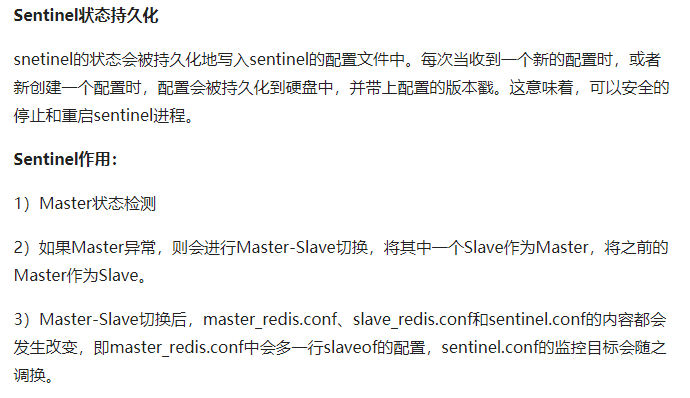

Redis的集群方案大致有三种：
1. redis cluster集群方案；
2. master/slave主从方案；
3. 哨兵模式

来进行主从替换以及故障恢复。

#### 介绍

> Sentinel(哨兵)是用于监控redis集群中Master状态的工具，是Redis 的高可用性解决方案，sentinel哨兵模式已经被集成在redis2.4之后的版本中。sentinel是redis高可用的解决方案，sentinel系统可以监视一个或者多个redis master服务，以及这些master服务的所有从服务；当某个master服务下线时，自动将该master下的某个从服务升级为master服务替代已下线的master服务继续处理请求。

sentinel可以让redis实现主从复制，当一个集群中的master失效之后，sentinel可以选举出一个新的master用于自动接替master的工作，集群中的其他redis服务器自动指向新的master同步数据。一般建议sentinel采取奇数台，防止某一台sentinel无法连接到master导致误切换。其结构如下:

*Redis-Sentinel* 是Redis官方推荐的高可用性(HA)解决方案，当用Redis做Master-slave的高可用方案时，假如master宕机了，Redis本身(包括它的很多客户端)都没有实现自动进行主备切换，而Redis-sentinel本身也是一个独立运行的进程，它能监控多个master-slave集群，发现master宕机后能进行自动切换。Sentinel由一个或多个Sentinel 实例 组成的Sentinel 系统可以监视任意多个主服务器，以及这些主服务器属下的所有从服务器，并在被监视的主服务器进入下线状态时，自动将下线主服务器属下的某个从服务器升级为新的主服务器。

https://www.toutiao.com/i6717614498926035468/?tt_from=weixin&utm_campaign=client_share&wxshare_count=1&timestamp=1594109998&app=news_article&utm_source=weixin&utm_medium=toutiao_android&use_new_style=1&req_id=20200707161957010011049013230097D8&group_id=6717614498926035468

#### 故障转移

https://www.jianshu.com/p/3f49a681931a
