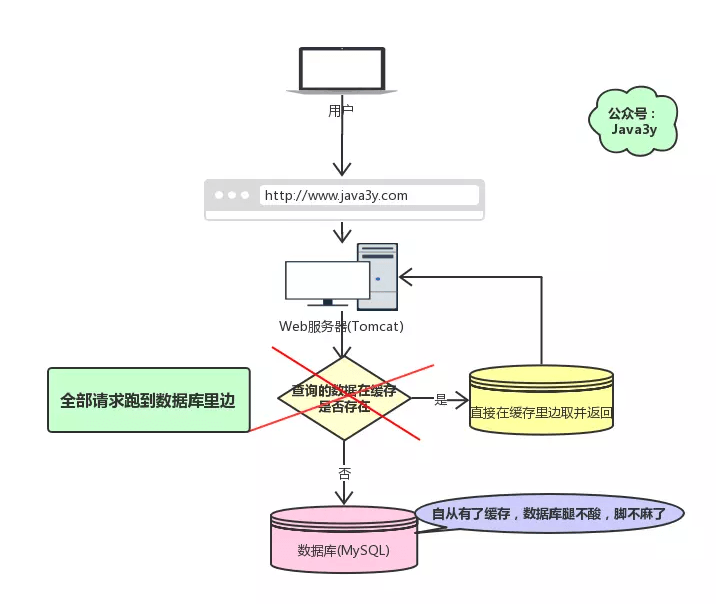
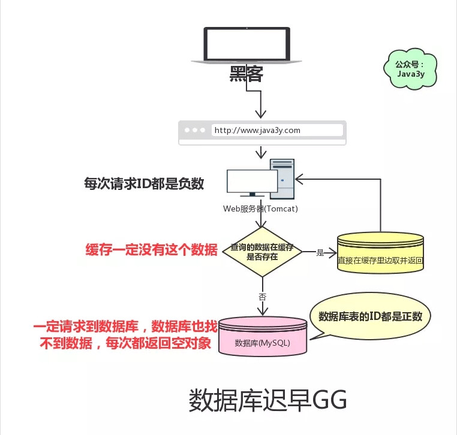

### 缓存雪崩

- Redis挂掉，请求全部走数据库
> Redis高可用(主从架构)，尽量避免Redis挂掉的情况发生

- 缓存数据设置的过期时间是相同的，并且Redis恰好将这部分的数据全部删除。这就会导致这段时间内，这些缓存同时失效，全部请求落到数据库中。
> 设置键值有效期的时候加多一个随机值，可以大幅度减少缓存在同一时间过期的情况发生。

### 缓存穿透

- 查询一个一定不存在的数据。由于缓存没有命中，并且处于容错考虑，缓存中查不到数据则不写入缓存，这将导致这个不存在的数据每次请求都要到数据库查询，失去了缓存的意义。
 

解决方案：

1. 请求参数过滤
2. 布隆过滤器 (BloomFilter) 或者压缩 filter 提前拦截
3. 从数据库中查不到数据，也要将空对象设置到缓存中去。有效时间较短

### 如何保证缓存与数据库的双写一致性？

##### Cache Aside Pattern

最经典的缓存+数据库读写模式，就是`Cache Aside Pattern`。

读的时候，先读缓存，缓存没有的话，就读数据库，然后取出数据后放入缓存，同时返回相应。

更新的时候，先更新数据库，然后再删除缓存

> 为什么是删除缓存，而不是更新缓存？

原因很简单，很多时候，在复杂点的场景，缓存不单单是数据库中直接取出来的值。

比如可能更新了某个表的一个字段，然后其对应的缓存，是需要查询另外两个表的数据并进行运算，才能计算出缓存最新的值得。

另外更新缓存的代价有时候是很高的。是不是说，每次修改数据库的时候，就一定要将其对应的缓存更新一份？也许有的场景是这样，但是对应比较复杂的缓存数据计算的场景，就不是这样了。如果你频繁修改一个缓存设计的多个表，缓存也频繁更新。但是问题在于，这个缓存会不会被频繁访问到？

> 举个例子，一个缓存设计的表的字段，在一分钟内就修改了20次，或者是100次，那么缓存更新20次，100次；但是这个缓存在一分钟内只被读取了1次，有大量的冷数据。实际上，如果你只是删除缓存的话，那么在1分钟内，这个缓存不过就重新计算了1次而已，开销大幅度降低，用到缓存采取算缓存。

其实删除缓存，而不是更新缓存，就是一个lazy计算的思想，不要每次都重新做复杂的计算，不管它会不会用到，而是让它到需要被使用的时候再重新计算。

##### 最初级的缓存不一致问题及解决方案

- 先修改数据库，再删除缓存。如果删除缓存失败了，那么会导致数据库中是新数据，缓存中是旧数据，数据就出现了不一致。

> 解决思路：先删除缓存，再修改数据库。如果数据库修改失败了，那么数据库中的是旧数据，缓存中是空的，那么数据不会不一致。因为读的时候缓存没有，则读数据库中旧数据，然后更新到缓存中。

##### 比较复杂的数据不一致问题分析

数据发生了变更，先删除了缓存，然后再去修改数据库，此时还没修改。一个请求过来，先读取缓存，发现缓存空了，去查数据库，查到了修改前的旧数据，放到了缓存中。随后数据变更的程序完成了数据库的修改。

完了，数据库和缓存中的数据不一样了。。。

###### 为什么上亿流量`高并发`场景下，缓存会出现这个问题？

只有在对一个数据在`高并发`的进行读写的时候，才可能会出现这种问题。其实如果说你的并发量很低的话，特别是读并发很低，每天访问量就1万次，那么很少的情况下，会出现刚才描述的那种不一致的场景。但是问题是，如果每天的是上亿的流量，每秒并发读是几万，每秒只要有数据更新的请求，就可能会出现上述的`数据库+缓存不一致`的情况。

#### 解决方案如下：

基于订阅`MySQL`的`binlog`的同步机制

> 读取`binlog`后分析，利用消息队列，推送更新`Redis`缓存数据

一旦`MySQL`中产生了新的写入，更新，删除等操作，就可以把`binlog`相关的消息推送至`Redis`，`Redis`再根据`binlog`中的记录，对`Redis`进行操作。

其实这种机制，很类似`MySQL`的主从备份机制，因为`MySQL`的主备也是通过binlog来实现的数据一致性。

这里可以结合使用`canal`(阿里开源的一款框架)，通过框架可以对`MySQL`的`binlog`进行订阅，而`canal`正是模仿了`MySQL`的`slave`数据库备份请求，使得`Redis`的数据更新达到了相同的效果。

[参考文章](https://www.cnblogs.com/hunna/p/11942688.html)
