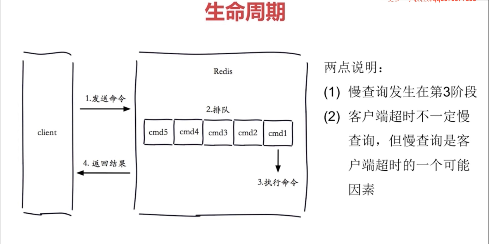
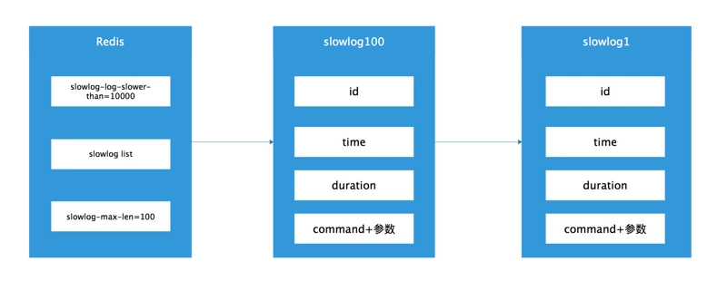

redis系统在命令执行前后计算每条命令的执行时间，当超过预设阈值，就将这条命令的相关信息(例如：发生时间，耗时，命令的详细信息)记录到慢查询日志中


**慢查询只记录第三步【执行命令】的时间**

#### 常见的配置项

> slowlog-log-slower-than  预设阈值。单位微妙，默认值10000. 等于0会记录所有命令；小于0任何命令都不记录

> slowlog-max-len 慢查询日志最多存储多少条。默认值128；实际上Redis会使用一个列表来存储慢查询日志，slowlog-max-len就是列表的最大长度。当超过最大列表长度时，最早插入的一条命令将会从列表中移除。

#### 常见命令

1. 获取慢查询日志

> slowlog get [n]   参数n可以执行条数

```code
127.0.0.1:6370> slowlog get
    1) 1) (integer) 666
       2) (integer) 1456786500
       3) (integer) 11615
       4) 1) "BGREWRITEAOF"
    2) 1) (integer) 665
       2) (integer) 1456718400
       3) (integer) 12006
       4) 1) "SETEX"
          2) "video_info_200"
          3) "300"
          4) "2"

```

可以看到每个查询日志有4个属性组成,分别是慢查询日志的表示id、发生时间戳、命令耗时、执行命令和参数,慢查询列表:





2. 获取慢查询日志队列当前长度

> slowlog len

例如,当前Redis中有45条慢查询:

```code

 127.0.0.1:6370> slowlog len
 (integer) 23
```

3. 慢查询日志重置

> slowlog reset

实际是对列表做清理操作,例如:

```code
127.0.0.1:6370> slowlog len
(integer) 23
127.0.0.1:6370> slowlog reset
OK
127.0.0.1:6370> slowlog len
(integer) 0

```
