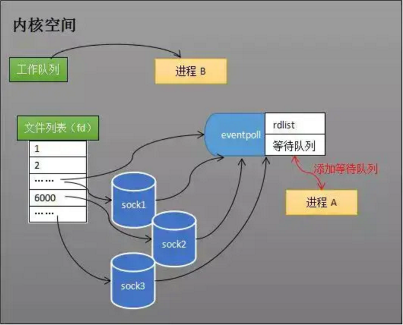
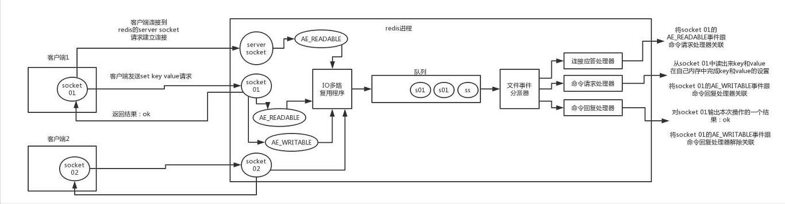
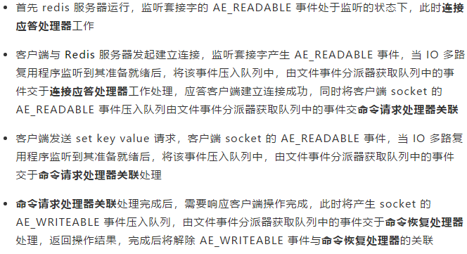
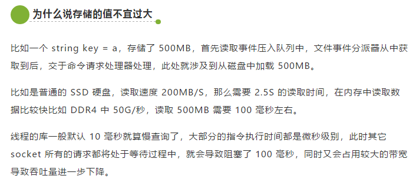

## redis

**Redis本质上是一个Key-Value类型的内存数据库**，很像memcached，整个数据库统统加载在内存当中进行操作，定期通过异步操作把数据库数据flush到硬盘上进行保存。因为是纯内存操作，Redis的性能非常出色，每秒可以处理超过 10万次读写操作，是已知性能最快的Key-Value DB。

#### 机制
> 单线程的Redis为什么这么快，为什么响应延迟这么低

- 纯内存操作
- 单线程操作，避免了频繁的上下文切换
- 采用了非阻塞I/O多路复用机制

**redis利用队列技术将并发访问变为串行访问，消除了传统数据库串行控制的开销**

#### 好处

- 速度快，因为数据存在内存中，类似于HashMap，HashMap的优势就是查找和操作的时间复杂度都是O(1)

- 支持丰富数据类型，支持string，list，set，sorted set，hash

#### redis相比memcached有哪些优势？

- `memcached`所有的值均是简单的字符串，`redis`作为其替代者，支持更为丰富的数据类型
- `redis`的速度比`memcached`快很多
- `redis`可以持久化其数据

#### Memcache与Redis的区别都有哪些？

- 存储方式 `Memecache`把数据全部存在内存之中，断电后会挂掉，数据不能超过内存大小。`Redis`有部份存在硬盘上，这样能保证数据的持久性。
- 数据支持类型`Memcache`对数据类型支持相对简单。`Redis`有复杂的数据类型。
- 使用底层模型不同它们之间底层实现方式以及与客户端之间通信的应用协议不一样。`Redis`直接自己构建了VM 机制 ，因为一般的系统调用系统函数的话，会浪费一定的时间去移动和请求。

#### redis的缓存失效策略和主键失效机制

6种数据淘汰策略:
- **volatile-lru**：从已设置过期时间的数据集（server.db[i].expires）中挑选最近最少使用的数据淘汰
- **volatile-ttl**：从已设置过期时间的数据集（server.db[i].expires）中挑选将要过期的数据淘汰
- **volatile-random**：从已设置过期时间的数据集（server.db[i].expires）中任意选择数据淘汰
- **allkeys-lru**：从数据集（server.db[i].dict）中挑选最近最少使用的数据淘汰
- **allkeys-random**：从数据集（server.db[i].dict）中任意选择数据淘汰
- **no-enviction**（驱逐）：禁止驱逐数据

使用策略规则：

- 如果数据呈现幂律分布，也就是一部分数据访问频率高，一部分数据访问频率低，则使用allkeys-lru

- 如果数据呈现平等分布，也就是所有的数据访问频率都相同，则使用allkeys-random

#### redis的并发竞争问题如何解决?

> Redis为**单进程单线程模式**，采用队列模式将并发访问变为串行访问。Redis本身没有锁的概念，Redis对于多个客户端连接并不存在竞争.

#### redis主要通过三个方面来满足高效吞吐量的性能需求：
- 高效的数据结构
- 多路复用IO模型
- 事件机制

1. 高效的数据结构
> Redis支持的几种高效的数据结构string(字符串),hash(哈希),list(列表),set(集合),zset(有序集合)。
>
> 以上几种对外暴露的数据结构它们的底层编码方式都是做了不同的优化。

2. 多路复用IO模型
> 假设某一时刻与Redis服务器建立了1万个长连接，对于阻塞式IO的做法是，对每一条连接都建议个线程来处理，那么就需要1万个线程，同时根据我们的经验对于IO密集型的操作我们一般设置，线程数 = 2 * CPU数量 + 1，对于CPU密集型的操作一般设置线程 = CPU数量 + 1.
>
> 像阻塞式IO这也动则创建成千上万的线程，系统是无法承载这样的负荷的更加谈不上高效的吞吐量和服务了。

> 而多路复用IO模型的做法是，用一个线程将这一万个建立成功的链接陆续的放入event_poll，event_poll会为这一万个长连接注册回调函数，当某一个长连接准备就绪后（建立连接成功，数据读取完成等），就会通过回调函数写入到event_poll的就绪队列rdlist中，这样这个单线程就可以通过读取rdlist获取到需要的数据。

> 需要注意的是，除了异步IO外，其他的I/O模型其实都可以归类为阻塞式I/O模型，不同的是像阻塞式I/O模型在第一阶段读取数据的时候，如果次数数据未准备就绪需要阻塞，在第二段数据准备就绪后需要将数据从内核态复制到用户态这一个也是需要阻塞的。而多路复用IO模型在第一阶段是不阻塞的，只会在第二阶段阻塞。

> 通过这种方式，就可以用1个或者几个线程来处理大量的连接了，极大地提高了吞吐量。

Redis 客户端与 Redis 服务端建立连接，发送命令，Redis 服务器响应命令都是需要通过事件机制来做的，如下图

