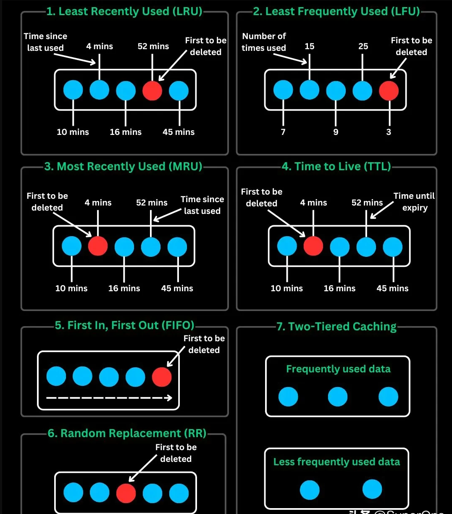

1. 最近最少使用（𝐋𝐑𝐔）
- 优先移除最近最少被访问的数据
- 适用于旧数据再次使用概率较低的场景
- 示例：浏览器使用LRU算法在新开标签页时清除内存中的旧页面

2. 最不经常使用（𝐋𝐅𝐔）
- 淘汰长期访问频率最低的数据
- 优先保留高频使用内容
- 示例：CDN用LFU缓存热门视频，移除冷门内容

3. 最近最多使用（𝐌𝐑𝐔）
- LRU的逆向策略，优先移除最新访问数据
- 适用于近期数据快速失效的场景
- 示例：音乐APP中刚播放的歌曲可能不再重复播放，适合MRU策略

4. 生存时间（𝐓𝐓𝐋）
- 设置数据过期时间自动淘汰
- 防止数据过时，适用于分布式系统
- 示例：DNS记录的TTL机制确保IP变更后客户端及时更新映射

5. 先进先出（𝐅𝐈𝐅𝐎）
- 按存储时间顺序淘汰最早数据
- 实现简单但可能误删有效数据
- 示例：基于队列的简易缓存系统

6. 随机替换（𝐑𝐑）
- 缓存满载时随机淘汰条目
- 低开销但性能不可预测
- 示例：网络路由器用RR管理有限内存，避免复杂策略

7. 两级缓存架构
- 组合高速内存缓存（如Redis）和低速持久化存储
- 通过热冷数据分层优化速度与存储
- 示例：CDN将高频内容存于内存（L1），低频内容存于磁盘（L2）

💡 没有完美策略，选择需考虑：
- 数据访问模式（读多写少？高并发写入？）
- 系统资源限制（内存/CPU/存储）
- 性能平衡（延迟敏感度与数据准确性）

