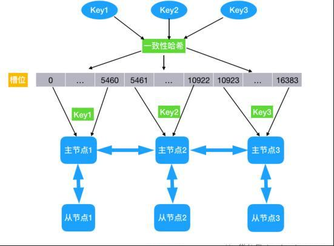

无论是主从复制模式，还是哨兵模式都没有解决分布式写的问题，也就是所有的方案都只能往一个节点写数据，数据存储能力受单节点限制。

哨兵模式仅仅解决了主从复制模式下，发生故障后不能自动切换的问题。

为了解决分布式写的问题，Redis提供了集群功能。

Redis集群可以实现分布式写。集群中的节点分为主节点和从节点。主节点负责数据的读写以及集群信息的维护，从节点负责同步主节点的信息。

> Redis集群利用数据分片的概念，**将要操作的Key进行哈希计算，根据得到的结果决定这个Key应该存储到哪个主节点**。这样就可以利用多个主节点进行分布式写操作。进行读操作的时候也会先计算Key的哈希值，然后找到对应的主节点。

很遗憾的是，集群模式也不是百分百完美，比如 key 的批量操作会受限制，只有当操作的 key都位于一个槽位时才能进行操作。 还有 Keys 操作，只能在任一节点发生，不能 跨 节点。 其实这些所有缺点，都是因为分布式写造成的，因为你把数据分别存到了不同的 Redis 节点。

### 总结

> Redis 由单节点的持久化，到主从复制模式，再到哨兵模式，再到最后的集群模式。一路打怪升级，不断的完善自己。

https://mp.weixin.qq.com/s?__biz=Mzg2NjE5NDQyOA==&mid=2247483762&amp;idx=1&amp;sn=f377cf428ac99d9c940d7e4c485de42e&source=41#wechat_redirect

https://segmentfault.com/a/1190000019290274

https://segmentfault.com/a/1190000020747511

https://segmentfault.com/a/1190000020762868
