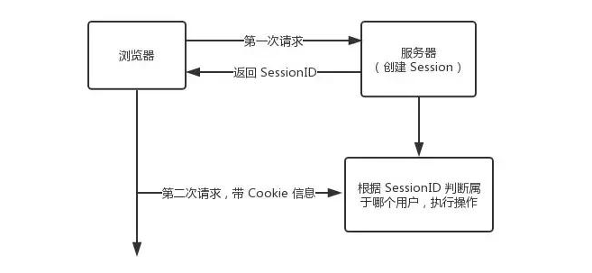

### Cookie

> 是服务器发送到用户浏览器并保存在本地的一小块数据，它会在下次向相同服务器再发起请求时被携带并发送到服务器上。通常，它用于告知服务端两个请求是否来自同一浏览器，如保证用户的登录状态。Cookie使基于无状态的HTTP协议记录稳定的状态成为了可能。

Cookie主要用于三个方面：

- 会话状态管理(如用户登录状态)
- 个性化设置(用户自定义设置，主题等)
- 浏览器行为跟踪(如跟踪分析用户行为等)

### Session

> Session代表着服务器和客户端一次会话的过程。Session对象存储特定用户会话所需的属性及配置信息。这样，当用户在应用程序的Web页之间跳转时，存储在Session对象的变量将不会丢失，而是在整个用户会话中一直存在下去。当客户端关闭会话，或者Session超时失效时会话结束。

### Cookie与Session对比

- 作用范围不同

> Cookie保存在客户端，容易被窃取；Session保存在服务器端，相对安全。

- 存储方式不同

> Cookie只能保存ASCII；Session可以存任意数据格式，一般我们会存一些常用数据，如user_id

- 有效期不同

> Cookie可设置为长时间保持；Session一般失效时间较短，客户端关闭或者Session超时都会失效。

- 存储大小不同

> 单个Cookie保存的数据不能超过4k；Session可存储数据大小远远高于Cookie

用户第一次请求服务器的时候，服务器根据用户提交的相关信息，创建对应的Session，请求返回时，将此Session的唯一标识信息SessionID返回给浏览器，浏览器接收到服务器返回的SessionID信息后，会将此信息存入到Cookie中，同时Cookie记录此SessionID属于哪个域名。

当用户第二次访问服务器的时候，请求会自动判断此域名下是否存在Cookie信息，如果存在自动将Cookie信息也发送给服务器，服务器会自动从Cookie中获取SessionID，再根据SessionID查找对应的Session信息，如果没有找到说明用户没有登录或者登录失效，如果找到Session证明用户已经登录可执行后面的操作。

SessionID是连接Cookie和Session的一道桥梁，大部分系统也是根据此原理来验证用户登录状态。

##### 思考：如果浏览器禁用了Cookie，如何保证整个机制正常运转？

- 每次请求中都携带一个 SessionID 的参数，也可以 Post 的方式提交，也可以在请求的地址后面拼接 xxx?SessionID=123456...。

- TOKEN机制。Token 机制多用于 App 客户端和服务器交互的模式，也可以用于 Web 端做用户状态管理。JWT
