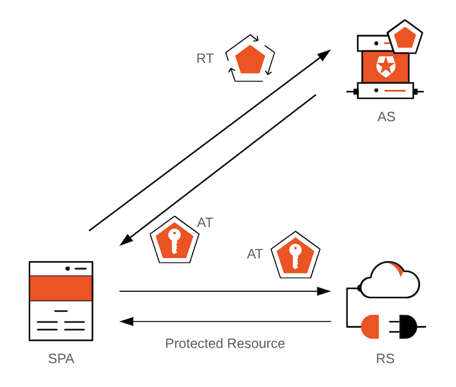

## OAuth2.0

> OAuth2.0 是行业标准的授权协议。OAuth2.0 授权框架允许第三方程序应用在资源所有者允许的情况下获得访问权限。OAuth的核心就是向第三方应用颁发令牌。

当用户登录时，授权服务器会发出访问令牌，这是客户端应用程序可以用来对 API 服务器进行安全调用的工件。当客户端应用程序需要代表用户访问服务器上受保护的资源时，访问令牌让客户端向服务器发出信号，表明它已收到用户授权以执行某些任务或访问某些资源。

#### OAuth 授权类型

- Authorization Code

>

- PKCE
- Client Credentials
- Device Code
- Refresh Token

#### OAuth Access Tokens

OAuth Access Token 是OAuth 客户端用来向资源服务器发出请求的字符串。

#### OAuth Refresh Token

OAuth Refresh Token OAuth 客户端可以使用它来获取新的访问令牌，而无需用户交互。

OAuth Refresh Token 不得允许客户端超出原始授权范围的任何访问权限。出于安全目的，一般Access Token的有效期会比较短，一旦过期后，客户端就可以使用Refresh Token来获取新的Access Token，而无需要求用户再次登录授权。

只要Refresh Token有效且未过期，客户端就可以获得新的Access Token。因此，具有很长生命周期的Refresh Token理论上可以赋予Token持有者无限的权力，以随时获取受保护的资源。

> SPA = Single-Page Application；AS = 授权服务器；RS = 资源服务器；AT = 访问令牌；RT = 刷新令牌。

#### Refresh Token 安全性问题

正如上面提到的，Refresh Token在保证程序的可用性和安全性的同时，由于其为不记名的字符串且具有较长的有效期，我们需要指定一个策略来限制或减少它们的使用，以防发生泄露或“损害”。所有持有Refresh Token的人都有权随时获得新的Access Token。他们都有可能是合法用户或是攻击者。

###### Refresh Token轮换

在客户端每次使用Refresh Token交换新的Access Token时，也会返回一个新的Refresh Token。因此，客户端不再拥有一个长期有效的Refresh Token。随着Refresh Token不断地交换和失效，非法访问带来的威胁也就减少了。

##### Refresh Token自动重用检测

Refresh Token是不记名的字符串。授权服务器在接收到新的Access Token 时，不可能知道是合法的还是恶意的。我们可以将所有用户视为潜在的恶意用户。

我们如何处理合法用户和恶意用户之间存在竞争条件的情况？例如：

-  🐱 合法用户拥有🔄 Refresh Token 1和🔑 Access Token 1。

-  😈 恶意用户设法从🐱 合法用户那里窃取🔄 Refresh Token 1。

-  🐱 合法用户使用🔄 Refresh Token 1来获取新的Refresh Token对。

-  🚓 Auth0 授权服务器返回🔄 Refresh Token 2和 🔑 Access Token 2给🐱 Legitimate User。

-  😈 恶意用户然后尝试使用🔄 Refresh Token 1来获取新的Access Token，那是纯粹的邪恶！

你认为接下来应该发生什么？😈恶意用户会设法获得新的访问令牌吗？

当您的身份平台具有🤖 自动重用检测时会发生这种情况：

- 🚓 Auth0 授权服务器一直在跟踪从原始Refresh Token下发的所有Refresh Token。也就是说，它创建了一个“令牌家族”。

- 🚓 Auth0 授权服务器识别出有人在重用🔄 Refresh Token 1 并立即使refresh Token 系列失效，包括🔄 Refresh Token 2。

- 🚓 Auth0 授权服务器向😈 恶意用户返回拒绝访问响应。

- 🔑 访问令牌 2到期，并且🐱 合法用户尝试使用🔄 刷新令牌 2请求新的刷新访问令牌对。

- 🚓 Auth0 授权服务器向🐱 合法用户返回拒绝访问响应。

- 🚓 Auth0 授权服务器需要重新认证才能获得新的访问和刷新令牌。

当先前使用的刷新令牌发送到授权服务器时，最近发布的刷新令牌立即失效至关重要。这可以防止使用同一令牌系列中的任何刷新令牌来获取新的访问令牌。

无论合法用户还是恶意用户能够先将🔄Refresh Token 1 换成新的Refresh Token对，这种保护机制都有效。如果不强制发送者约束，授权服务器在重放攻击的情况下无法知道哪个参与者是合法的或恶意的。

自动重用检测是刷新令牌轮换策略的关键组成部分。服务器已经使已经使用的刷新令牌失效。但是，由于授权服务器无法知道合法用户是否持有最新的刷新令牌，因此为了安全起见，它会使整个令牌系列无效。

https://github.com/thephpleague?q=oauth&type=all&language=&sort=

https://github.com/thephpleague/oauth2-server

https://oauth2.thephpleague.com/terminology/

https://github.com/thephpleague/oauth2-client

https://oauth2-client.thephpleague.com/providers/league/

https://oauth2-client.thephpleague.com/providers/thirdparty/

https://oauth.net/2/grant-types/authorization-code/

https://auth0.com/blog/refresh-tokens-what-are-they-and-when-to-use-them/

https://www.ruanyifeng.com/blog/2019/04/oauth-grant-types.html
