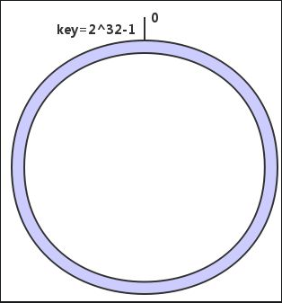
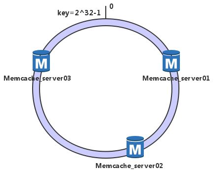
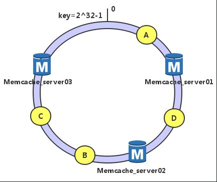
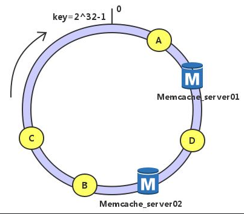
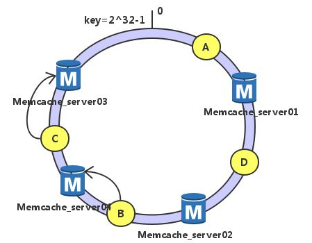

> 有没有好奇过redis、memcache等是怎么实现集群负载均衡的呢？

其实他们都是通过一致性hash算法实现节点调度的。

讲一致性hash算法前，先简述一下`求余hash算法`：
```bash
hash(object)%N

```
1. 一个缓存服务器宕机了，这样所有映射到这台服务器的对象都会失效，我们需要把属于该服务器中的缓存移除，这时候缓存服务器是 N-1 台，映射公式变成了 `hash(object)%(N-1)` ；
2. 由于QPS升高，我们需要添加多一台服务器，这时候服务器是 N+1 台，映射公式变成了 `hash(object)%(N+1)` 。


上面的做法会存在一个问题，当1和2的改变发生时，都会出现所有的服务器需要进行数据迁移。


#### 一致性HASH算法

一致性HASH算法的出现有效地解决了上面普通求余算法在节点变动后面临全部缓存失效的问题：

```code
type Consistent struct {

　　numOfVirtualNode int

　　hashSortedNodes []uint32

　　circle map[uint32]string

　　nodes map[string]bool

}
```
简单地说，一致性哈希将整个哈希值空间组织成一个虚拟的圆环，如假设某空间哈希函数H的值空间是0-2^32 -1 （既哈希值是一个32位无符号整形），整个哈希空间如下：



下一步将各个服务器使用哈希算法计算出每台机器的位置，具体可以使用服务器的IP地址或者主机名作为关键字，并且是按照顺时针排列：

```code

func hashKey(host string) uint32 {

 　　scratch := []byte(host)

　　return crc32.ChecksumIEEE(scratch)

}

```

这里我们假设三台节点memcache经计算后位置如下：



接下来使用相同的算法计算出数据的哈希值，并由此确定数据在此哈希环上的位置。

加入我们有数据A，B，C和D，经过哈希计算后位置如下：



根据一致性哈希算法，数据A就被绑定到了server01上，D被绑定到了server02上，B、C在server03上，是按照顺时针找最近服务节点方法


这样得到的哈希环调度方法，有很高的容错性和可扩展性：

假设server03宕机




**可以看到此时A、C、B不会受到影响，只是将B、C节点被重定位到Server 1**。一般的，在一致性哈希算法中，如果一台服务器不可用，则受影响的数据仅仅是此服务器到其环空间中前一台服务器（即顺着逆时针方向行走遇到的第一台服务器）之间数据，其它不会受到影响。


**考虑另外一种情况，如果我们在系统中增加一台服务器Memcached Server 04：**




此时A、D、C不受影响，只有B需要重定位到新的Server 4。**一般的，在一致性哈希算法中，如果增加一台服务器，则受影响的数据仅仅是新服务器到其环空间中前一台服务器（即顺着逆时针方向行走遇到的第一台服务器）之间数据，其它不会受到影响**。
