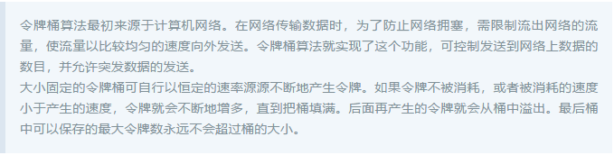
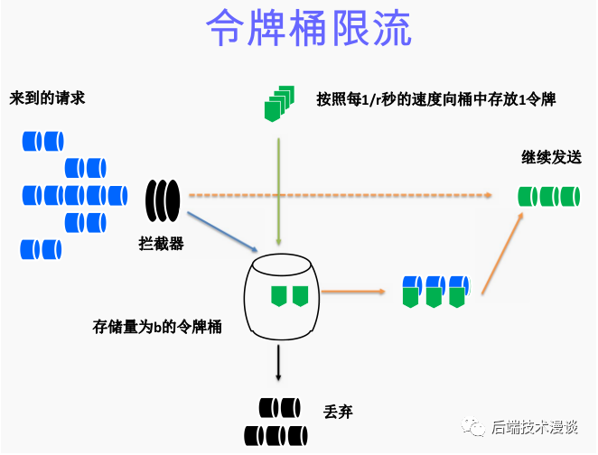
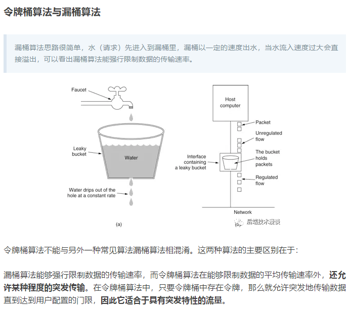
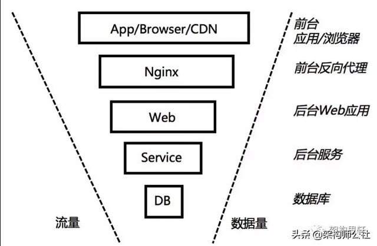
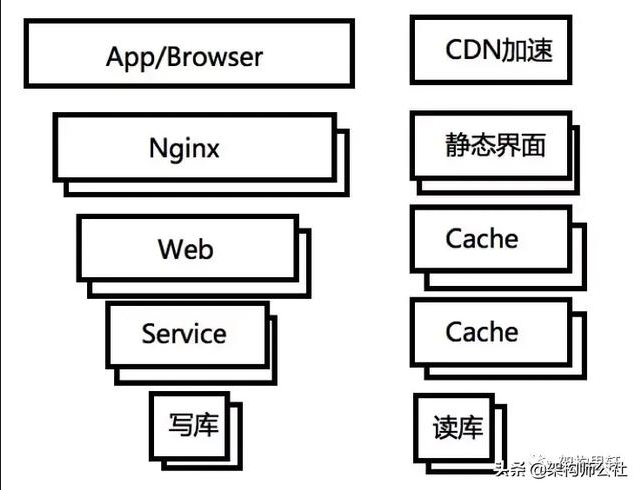

## 高并发访问

### 接口限流

接口限流本身也是系统安全防护的一种措施

- 令牌桶限流
- 单用户访问频率限流
- 抢购接口隐藏

#### 接口限流

在面临高并发的请购请求时，我们如果不对接口进行限流，可能会对后台系统造成极大的压力。尤其是对于下单的接口，过多的请求到达数据库会对系统的稳定性造成影响。

所以秒杀系统会进行选择独立于公司其他系统之外进行单独部署，以免秒杀业务崩溃影响到其他系统。

除了独立部署秒杀业务之外，我们能够做的就是尽量让后台系统稳定优雅地处理大量请求。

###### 令牌通限流法

### 分流
> 主要通过分布式集群技术，多台机器处理，提高并发能力。

### 动静分离

> 将动态数据和静态数据尽量分离，并通过缓存和CDN技术对数据读取进行加速

## 数据正确性

秒杀伴随着一系列业务流程，包括浏览商品，进入抢购页面，购买，扣除库存，支付。其中并发主要是与扣库存有关，要保证数据的正确性，防止超卖发生。大概的解决方法有：

1. 减库存：事务判断，热点商品放到单独的热点库，增加并发锁。
2. 热点：对核心热点数据进行实时分析，并在系统中进行优化或隔离。
3. 限流降级：请求限流，控制系统的访问；对服务的下流依赖进行降级，保证核心链路不被影响。
4. 异步化：是指把购买请求的接受和处理异步化。购买请求先放到队列中，这个请求非常高效，返回客户信息。

## 防作弊

抢购还需要保证公平性，防止黄牛党和自动抢票软件。从技术角度，大概方法有：
答题：为了增加购买的复杂度；延缓请求。
Cache校验：处理用户购买请求时校验缓存中是否已记录此商品的购买。

## 秒杀系统设计原则

1. 请求请求数尽量少
> 前台请求会增加浏览器的负担，尽量简化或合并页面大小（css/js，图片等）；减少DNS解析
2. 后台请求数尽量少
> 后台数据会增加网络传输，压缩和字符编码，消耗CPU。需要梳理后台依赖的数据和服务，关注序列化/反序列化方式，减少不必要的数据交互。
3. 调用路径要尽量少
4. 尽量不要有单点
> 高可用和稳定性角度，消除单点；服务无状态化，解耦服务状态和机器，如机器配置动态化；有状态的存储，通过冗余备份提高可用性。

### 高并发之“访问拦截”

高并发的访问拦截主要思路是：

> 从浏览器/反向代理/Web层/服务层 多层拦截流量，尽量把访问拦截在离用户最近的层，尽可能地过滤无效请求，让“漏斗”最末端的才是最有效的请求。同时，用户请求最早的得到处理，也减少了每次请求的RT，进而提高了系统的QPS和并发程度

浏览器访问拦截

> 防止用户的不必要的点击，可以在产品层面限制用户的行为，比如点击后按钮不可用；限定时间内接受请求；防作弊；答题/Cache校验等

CDN加速

> CDN全称Content Delivery NetWork，即内容分发网络。简单来说，就是把原服务器上的数据复制到其他服务器上，用户就近访问服务器获取资源。缺点是内容变更生效慢。

反向代理访问拦截

> 主要是动静分离，静态文件作为web项目的一部分进行发布；另外通过Nginx托管静态文件，减轻Web服务器的压力。【前后端分离？】

Web层和Service层访问拦截

> 主要是动态数据访问，可以采用缓存的策略，减少对下一层的数据访问。缓存又可以分为本地缓存和redis，memcache等缓存中间件。

高并发之“分流”

> 分流主要通过分布式集群技术，多台机器处理，提高并发能力。

Nginx负载均衡

> Nginx可以支持10w的并发访问，Nginx支持配置请求的代理策略，把请求路由到多个web服务器处理。Nginx支持的负载均衡策略包括：轮询，权重，ip_hash，fair，url_hash等

Redis集群：

> redis单台几十万的QPS，可通过Redis集群，把数据分配到多台服务器上，减轻每台机器的负载

MySQL读写分离：

> 对于读请求，一般采用读写分离的策略。读库应用单独设置索引，提高读性能。

1.秒杀活动中，商品库存放在redis中不可取，但是可以完成一些前置限流工作，后续实际库存扣减工作还是要MySQL落地为准。Redis可以作为库存计数器，当db实例扣减完了回写redis，让后续请求不在发送。

2.为防超卖，后续需要对账机制。核对每条订单的购买数目与总数，把超卖订单退还。

3.如果使用redis集群模式，主备同步有一定的延迟。

4.可以对商品库存进行分片，redis锁可以落地当不同的分片上。
