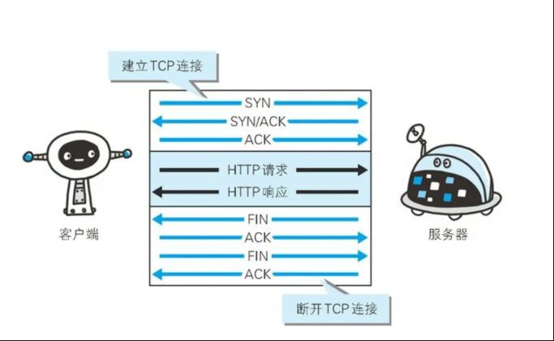
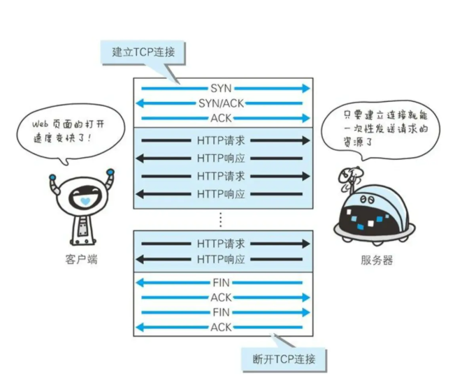
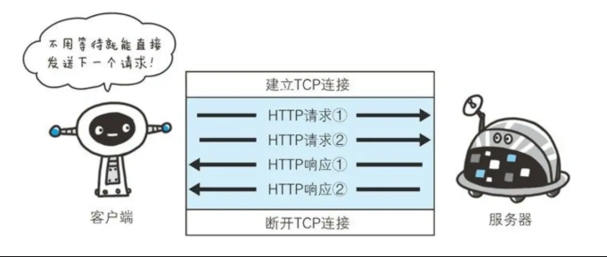

#### 定义
> 超文本传输协议(HyperText Transfer Protocol)是一种用于分布式，协作式和超媒体信息系统的应用层协议。HTTP是万维网的数据通信基础。

#### 概述

HTTP是一个客户端终端(用户)和服务器(网站)请求和应答的标准(TCP)。通过使用网页浏览器，网络爬虫或者其他的工具，客户端发起一个HTTP请求到服务器上指定的端口(默认端口80)。我们称这个客户端为用户代理程序(user agent)。应答的服务器上存储着一些资源，比如HTML文件或者图像。我们称这个应答服务器为资源服务器(origin server)。在用户代理和源服务器中间可能存在多个“中间层”，比如代理服务器，网关或者隧道(tunnel)。

尽管TCP/IP 协议是互联网上最流行的应用，HTTP协议中，并没有规定使用它或它支持的层。事实上，HTTP可以在任何互联网协议上，或其他网络上实现。HTTP假定其下层协议提供可靠的传输。因此，任何能够提供这种保证的协议都可以被其使用。因此也就是在TCP/IP 协议族使用TCP作为其传输层。

通常，由HTTP客户端发起一个请求，创建一个到服务器指定的端口(默认80端口)的TCP连接。HTTP服务器则在这个端口监听客户端的请求。一旦收到请求，服务器会向客户端返回一个状态，比如“HTTP/1.1 200 OK”，以及返回的内容，如请求的文件，错误消息或者其他信息。

#### HTTP工作原理

HTTP协议定义Web客户端如何从Web服务器请求Web页面，以及服务器如何把Web页面传输给客户端。HTTP协议采用了请求/响应模型。客户端向服务器发送一个请求报文，请求包含请求的方法，URL，协议版本，请求头部和请求数据。

以下是HTTP请求/响应的步骤：
1. 客户端连接到Web服务器

  一个HTTP客户端，通常是浏览器，与Web服务器的HTTP端口(默认80)建立一个TCP套接字连接。

2. 发送HTTP请求

  通过TCP套接字，客户端向Web服务器发送一个文版的请求报文，一个请求报文由行，请求头部，空行和请求数据4部分组成。

3. 服务器接受请求并返回HTTP响应

  Web服务器解析请求，定位请求资源。服务器讲资源复写到TCP套接字，由客户端读取。一个响应由状态行，响应头部，空行和响应数据4部分组成。

4. 释放连接TCP连接

  若connection模式为close，则服务器主动关闭TCP连接，客户端被动关闭连接，释放TCP连接；若connection模式为keepalive，则该连接会保持一段时间，在该时间内可以继续接收请求。

5. 客户端浏览器解析HTML内容

  客户端浏览器首先解析状态行，查看表明请求是否成功的状态代码。然后解析每一个响应头，响应头告知以下为若干字节的HTML文档和文档的字符集。客户端浏览器读取响应数据HTML，根据HTML的语法对其进行格式化，并在浏览器窗口中显示。

例如：在浏览器地址栏键入URL，按下回车之后会经历以下流程：

  1. 浏览器向 DNS 服务器请求解析该 URL 中的域名所对应的 IP 地址;

  2. 解析出 IP 地址后，根据该 IP 地址和默认端口 80，和服务器建立TCP连接;

  3. 浏览器发出读取文件(URL 中域名后面部分对应的文件)的HTTP 请求，该请求报文作为 TCP 三次握手的第三个报文的数据发送给服务器;

  4. 服务器对浏览器请求作出响应，并把对应的 html 文本发送给浏览器;

  5. 释放 TCP连接;

  6. 浏览器将该 html 文本并显示内容; 　

#### HTTP协议是基于TCP/IP协议之上的应用层协议。

#####  基于 请求-响应 模式

 **HTTP协议规定，请求从客户端发出，最后服务器端响应该请求并返回。换句话说，肯定是先从客户端开始建立通信的，服务器端在没有接收到请求之前不会发送响应**

 ##### 无状态保存

 **HTTP是一种不保存状态，即无状态(stateless)协议。HTTP协议自身不对请求和响应之间的通信状态进行保存。也就是说在HTTP这个级别，协议对于发送过的请求或者响应都不做持久化处理**

 HTTP/1.1 虽然是无状态协议，但是为了实现期望的保持状态功能，于是引入了Cookie技术。有了Cookie再使用HTTP协议通信，就可以管理状态了。

 ##### 无连接

 无连接的含义是限制每次连接只处理一个请求。服务器处理完客户的请求，并收到客户的应答后，即断开连接。采用这种方式可以节省传输时间，并且可以提高并发性能，不能和每个用户建立长久的连接，请求一次响应一次，服务端和客户端就断开了。但是无连接有两种方式，早期的http协议是一个请求一个响应之后，直接就断开了，但是现在的http协议1.1版本不是直接就断开了，而是等几秒钟，这几秒钟是等什么呢，等着用户有后续的操作，如果用户在这几秒钟之内有新的请求，那么还是通过之前的连接通道来收发消息，如果过了这几秒钟用户没有发送新的请求，那么久会断开连接，这样可以提高效率，减少短时间内建立连接的次数，因为建立连接也是耗时的，默认的耗时是3秒钟。可以根据自己的网站用户行为分析统计出一个最优的等待时间。

**传统的HTTP应用中都是一次TCP连接一次request。**

这样的情况下效率有点低：

- 服务端负载增加，每个请求过来都得占用端口。
- 客户端或者服务端对客户端连接数的限制(chrome限制是6个)
  这种情况很多，比如页面加载(对于这种case的处理就是将静态资源放置在不同的domain或者压缩打包减少数量来提高效率)

HTTP/1.1协议里增加了keepalive的支持，并且默认开启。

客户端和服务端在建立连接并完成request后并不会立即断开TCP连接，而是在下次request来临时复用这次TCP连接。但是这里也必须要有TCP连接的timeout时间限制。不然会造成服务端端口被长期占用释放不了。

对于不适用keepalive的request来说，不管是客户端还是服务端都是通过TCP的链接的断开知道request的结束（TCP 挥手时会check 数据包的 seq， 保证数据完整性）。
支持keepalive后，如何知道request结束了呢？
在Http1.1的版本里， 解决方案是request 和reponse里使用contentLength来帮助确认是否收到全部数据。

另一个问题就是在使用keepalive的情况，客户端依然有同时发送多个请求的情况，比如网页加载是需要同时load多个静态资源。比如 浏览器默认最大连接数是6，现在有十个资源同时加载，那么这十个里会有6个并行，4个与前6个串行。

在keepalive里有个问题就是如果能知道每个repose与其对应的request的话，并发的请求可以只需要一次TCP连接，这也就是http2.0实现的多路复用。

