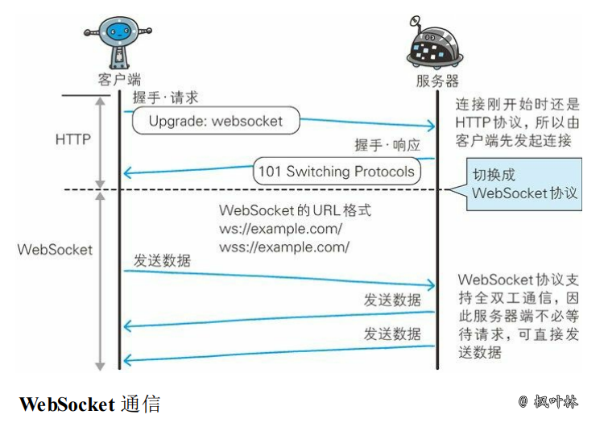

WebSocket是一种通信协议，定义了一个全双工通信信道，仅通过Web上的一个Socket即可进行通信。

WebSocket的出现，使得浏览器具备了实时双向通信的能力，是一种浏览器与服务器进行全双工通讯的网络技术，属于应用层协议。

它基于TCP传输协议，并复用HTTP的握手通道。

客户端、服务端数据的交换，离不开数据帧格式的定义。因此，在实际讲解数据交换之前，我们先来看下WebSocket的数据帧格式。

WebSocket客户端、服务端通信的最小单位是帧（frame），由1个或多个帧组成一条完整的消息（message）。

发送端：将消息切割成多个帧，并发送给服务端；

接收端：接收消息帧，并将关联的帧重新组装成完整的消息；

#### 主要特点

- 推送功能：支持由服务器向客户端推送数据的推送功能
- 减少通信量：只要建立起 WebSocket 连接，就希望一直保持连接状态

#### 心跳机制

心跳机制是定时发送一个自定义的结构体(心跳包)，让对方知道自己还活着，以确保连接的有效性的机制

#### 长连接

长连接，指在一个连接上可以连续发送多个数据包，在连接保持期间，如果没有数据包发送，需要双方发链路检测包

https://segmentfault.com/a/1190000012709475
