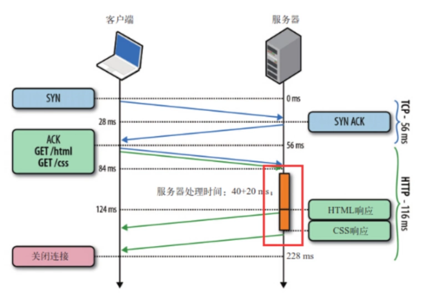
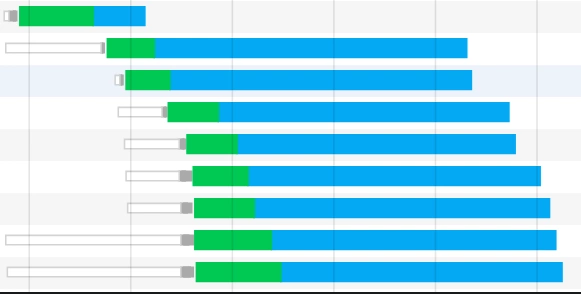
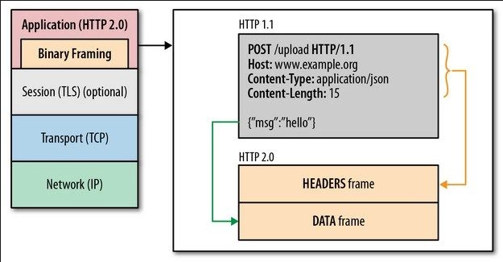

HTTP 是应用层协议，是基于TCP底层协议而来。

TCP的机制限定，每建立一个连接需要`3次握手`，断开连接则需要`4次挥手`。

HTTP协议采用“请求-应答”模式，HTTP1.0下，HTTP1.1非Keep-Alive模式下，每个请求都要新建一个连接，完成之后立即断开连接。如果有新的连接，则要重新建立请求连接（HTTP协议为无状态的协议）。

这种无状态性可以借助cookie/session机制来做身份认证和状态记录。不过也带来了比较麻烦的问题。

1. 首先，无连接的特性导致最大的性能缺陷就是`无法复用连接`。每次发送请求的时候，都需要进行一次TCP的连接，而TCP的连接释放过程又是比较费时的。这种无连接的特性会使得网络的利用率非常低。
2. 其次就是对头阻塞（head of line blocking）。由于HTTP 1.0规定下一个请求必须在前一个请求响应到达之前才能发送。假设一个请求响应一直不到达，那么下一个请求就不发送，同样的后面的请求也给阻塞了。

##### HTTP1.1

对于`HTTP1.1` ,不仅继承了`HTTP1.0`简单的特点，还克服了诸多`HTTP1.0`性能上的问题。

首先是长连接，`HTTP1.1`增加了一个`Connection`字段，通过设置`Keep-Alive`保持`HTTP`连接不断开，避免了每次客户端与服务器请求都要重复建立释放`TCP`连接，提高了网络的利用率。如果客户端想关闭`HTTP`连接，可以在请求头中携带`Connection:false`来告知服务器关闭请求。

其次，是HTTP1.1支持请求管道化（pipelining）。基于HTTP1.1的长连接，使得请求管线化成为可能。管线化使得请求能够“并行”传输。举个例子来说，如果响应的主题是一个HTML页面，页面中包含了许多img，这个时候Keep-Alive就起到了很大的作用，能够进行“并行”发送多个请求。

**需要注意的是，服务器必须按照客户端请求的先后顺序依次回送相应的结果，以保证客户端能够区分出每次请求的响应内容。**

也就是说，HTTP管道化可以让我们先进先出队列从客户端（请求队列）迁移到服务器（响应队列）。

如图所示，客户端同时发了两个请求分别来获取html和css，假如说服务器的css资源先准备就绪，服务器也会先发送html在发送css。

换句话说，只有等到html响应的资源完全传输完毕后，css响应的资源才能开始传输。也就是说，不允许同时存在两个并行的响应。

可见，HTTP1.1还是无法解决队头阻塞（head of line blocking）的问题。同时“管道化”技术存在各种各样的问题，所以很多浏览器要么根本不支持它，要么就直接默认关闭，并且开启的条件很苛刻...而且实际上好像并没有什么用处。

那我们在谷歌控制台看到的并行请求又是怎么一回事呢？

如图所示，绿色部分代表请求发起到服务器响应的一个等待时间，而蓝色部分表示资源的下载时间。按照理论来说，HTTP响应理应当是前一个响应的资源下载完了，下一个响应的资源才能开始下载。而这里却出现了响应资源下载并行的情况。这又是为什么呢？

其实，虽然HTTP1.1支持管道化，但是服务器也必须进行逐个响应的送回，这个是很大的一个缺陷。实际上，现阶段的浏览器厂商采取了另外一种做法，它允许我们打开多个TCP的会话。也就是说，上图我们看到的并行，**其实是不同的TCP连接上的HTTP请求和响应**。这也就是我们所熟悉的浏览器对同域下并行加载6~8个资源的限制。而这，才是真正的并行！

此外，HTTP1.1还加入了缓存处理（强缓存和协商缓存[[传送门](http://www.yangzicong.com/article/12)]）新的字段如cache-control，支持断点传输，以及增加了Host字段（使得一个服务器能够用来创建多个Web站点）。

##### HTTP2.0

HTTP2.0的新特性大致如下：

###### 二进制分帧

HTTP2.0通过在应用层和传输层之间增加一个二进制分帧层，突破了HTTP1.1的性能限制、改进传输性能。

可见，虽然`HTTP2.0`的协议和`HTTP1.x`协议之间的规范完全不同了，但是实际上`HTTP2.0`并没有改变`HTTP1.x`的语义。

简单来说，`HTTP2.0`只是把原来`HTTP1.x`的`header`和`body`部分用`frame`重新封装了一层而已。

###### 多路复用（连接共享）

下面是几个概念：
- 流（stream）：已建立连接上的双向字节流。
- 消息：与逻辑消息对应的完整的一系列数据帧。
- 帧（frame）：HTTP2.0通信的最小单位，每个帧包含帧头部，至少也会标识出当前帧所属的流（stream id）。

从图中可见，所有的HTTP2.0通信都在一个TCP连接上完成，这个连接可以承载任意数量的双向数据流。

每个数据流以消息的形式发送，而消息由一或多个帧组成。这些帧可以乱序发送，然后再根据每个帧头部的流标识符（stream id）重新组装。

举个例子，每个请求是一个数据流，数据流以消息的方式发送，而消息又分为多个帧，帧头部记录着stream id用来标识所属的数据流，不同属的帧可以在连接中随机混杂在一起。接收方可以根据stream id将帧再归属到各自不同的请求当中去。

另外，多路复用（连接共享）可能会导致关键请求被阻塞。HTTP2.0里每个数据流都可以设置优先级和依赖，优先级高的数据流会被服务器优先处理和返回给客户端，数据流还可以依赖其他的子数据流。

可见，HTTP2.0实现了真正的并行传输，它能够在一个TCP上进行任意数量HTTP请求。而这个强大的功能则是基于“二进制分帧”的特性。

###### 头部压缩

在`HTTP1.x`中，头部元数据都是以纯文本的形式发送的，通常会给每个请求增加500~800字节的负荷。

比如说`cookie`，默认情况下，浏览器会在每次请求的时候，把`cookie`附在`header`上面发送给服务器。（由于`cookie`比较大且每次都重复发送，一般不存储信息，只是用来做状态记录和身份认证）

`HTTP2.0`使用encoder来减少需要传输的`header`大小，通讯双方各自`cache`一份`header` `fields`表，既避免了重复`header`的传输，又减小了需要传输的大小。高效的压缩算法可以很大的压缩`header`，减少发送包的数量从而降低延迟。

###### 服务器推送

服务器除了对最初请求的响应外，服务器还可以额外的向客户端推送资源，而无需客户端明确的请求。

##### HTTP1.1的合并请求是否适用于HTTP2.0

首先，答案是“没有必要”。之所以没有必要，是因为这跟HTTP2.0的头部压缩有很大的关系。

在头部压缩技术中，客户端和服务器均会维护两份相同的静态字典和动态字典。

在静态字典中，包含了常见的头部名称以及头部名称与值的组合。静态字典在首次请求时就可以使用。那么现在头部的字段就可以被简写成静态字典中相应字段对应的index。

而动态字典跟连接的上下文相关，每个HTTP/2连接维护的动态字典是不尽相同的。动态字典可以在连接中不听的进行更新。

也就是说，原本完整的HTTP报文头部的键值对或字段，由于字典的存在，现在可以转换成索引index，在相应的端再进行查找还原，也就起到了压缩的作用。

所以，同一个连接上产生的请求和响应越多，动态字典累积得越全，头部压缩的效果也就越好，所以针对HTTP/2网站，最佳实践是不要合并资源。

另外，HTTP2.0多路复用使得请求可以并行传输，而HTTP1.1合并请求的一个原因也是为了防止过多的HTTP请求带来的阻塞问题。而现在HTTP2.0已经能够并行传输了，所以合并请求也就没有必要了。

### 总结

##### HTTP1.0

  - 无状态、无连接

##### HTTP1.1

  - 持久连接
  - 请求管道化
  - 增加缓存处理（新的字段如cache-control）
  - 增加Host字段、支持断点传输等

##### HTTP2.0

  - 二进制分帧
  - 多路复用（或连接共享）
  - 头部压缩
  - 服务器推送

### 参考
https://segmentfault.com/a/1190000022300361?utm_source=tag-newest#item-3-2

http://www.alloyteam.com/2017/01/http2-server-push-research/

http://www.yangzicong.com/article/12

https://www.jianshu.com/p/1ad439279974
