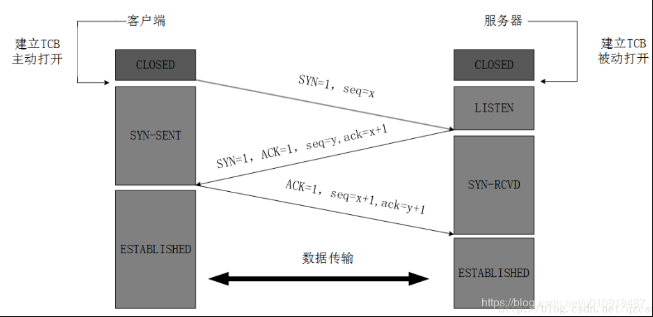
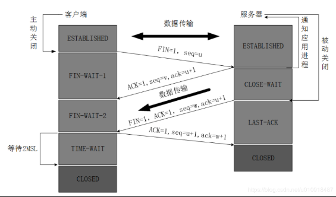

### 三次握手

> TCP位于传输层，作用是提供可靠的字节流服务，为了准确无误地将数据送达目的地，TCP协议采纳三次握手策略。

#### 原理

1. 发送端首先发送一个带有SYN标识的数据包SYN=1,seq=x给接收方
2. 接收方接收后，回传一个带有SYN/ACK标识的数据包SYN=1,ACK=1,seq=y,ack=x+1传递确认信息，标识我收到了。
3. 最后，发送方再回传一个带有ACK标识的数据包ACK=1,seq=x+1,ack=y+1，代表我知道了，表示握手结束

#### 过程分析

1. 第一次：客户端发送请求到服务器，服务器知道客户端发送，自己接收正常。SYN=1,seq=x
2. 第二次：服务器发给客户端，客户端知道自己发送、接收正常，服务器接收、发送正常。ACK=1,ack=x+1,SYN=1,seq=y
3. 客户端发给服务器：服务器知道客户端发送，接收正常，自己接收，发送也正常.seq=x+1,ACK=1,ack=y+1

上面分析过程可以看出，三次握手才能达到让双方都得出自己、对方的接收、发送能力都正常的结论的。

### 四次挥手

> 当被动方收到主动方的FIN报文通知时，它仅仅表示主动方没有数据再发送给被动方了。但未必被动方所有的数据都完整的发送给了主动方，所以被动方不会马上关闭SOCKET,它可能还需要发送一些数据给主动方后，再发送FIN报文给主动方，告诉主动方同意关闭连接，所以这里的ACK报文和FIN报文多数情况下都是分开发送的。

- 第一次挥手：客户端发出释放FIN=1，自己序列号seq=u，进入FIN-WAIT-1状态
- 第二次挥手：服务器收到客户端的后，发出ACK=1确认标志和客户端的确认号ack=u+1，自己的序列号seq=v，进入CLOSE-WAIT状态
- 第三次挥手：客户端收到服务器确认结果后，进入FIN-WAIT-2状态。此时服务器发送释放FIN=1信号，确认标志ACK=1，确认序号ack=u+1，自己序号seq=w，服务器进入LAST-ACK（最后确认态）
- 第四次挥手：客户端收到回复后，发送确认ACK=1，ack=w+1，自己的seq=u+1，客户端进入TIME-WAIT（时间等待）。客户端经过2个最长报文段寿命后，客户端CLOSE；服务器收到确认后，立刻进入CLOSE状态。

#### 四次挥手过程分析

- 第一次：客户端请求断开FIN,seq=u
- 第二次：服务器确认客户端的断开请求ACK,ack=u+1,seq=v
- 第三次：服务器请求断开FIN,seq=w,ACK,ack=u+1
- 第四次：客户端确认服务器的断开ACK,ack=w+1,seq=u+1

## QA

1. **为什么三次握手和四次挥手？**

  - 三次握手时，服务器同时把ACK和SYN放在一起发送到了客户端那里
  - 四次挥手时，当收到对方的 FIN 报文时，仅仅表示对方不再发送数据了但是还能接收数据，己方是否现在关闭发送数据通道，需要上层应用来决定，因此，己方 ACK 和 FIN 一般都会分开发送。
2. **为什么客户端最后还要等待2MSL？**
  - 客户端需要保证最后一次发送的ACK报文到服务器，如果服务器未收到，可以请求客户端重发，这样客户端还有时间再发，重启2MSL计时。2MSL就是一个发送和一个回复所需的最大时间。

3. **TCP 粘包问题**
  - 在 TCP 这种字节流协议上做应用层分包是网络编程的基本需求。**分包指的是在发生一个消息(message)或一帧(frame)数据时，通过一定的处理，让接收方能从字节流中识别并截取(还原)出一个个消息**。因此，“粘包问题”是个伪命题

### 参考文章

https://www.cnblogs.com/jainszhang/p/10641728.html
https://www.jianshu.com/p/d3725391af59
